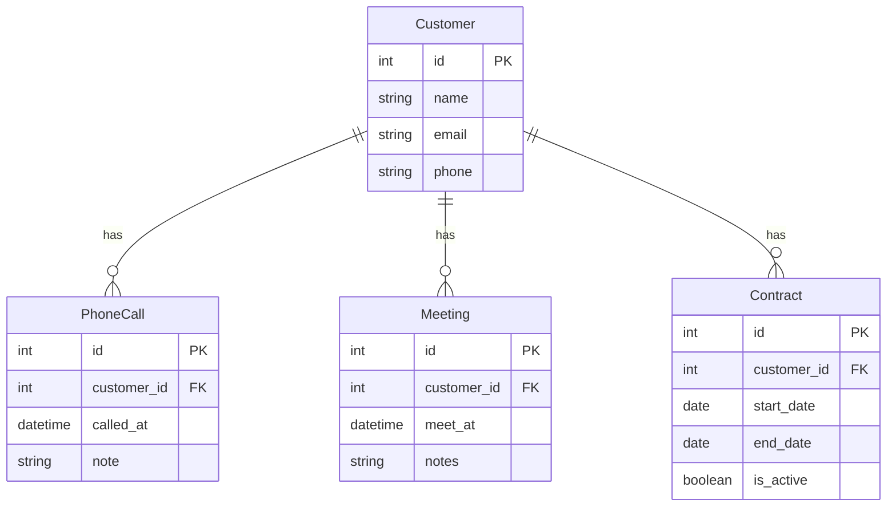

# 課題 1

## 解答 1

- １顧客につき１つのレコードが原則となるため、複数回の電話、面談記録ができない。
    - callNote が varchar 型なので、追記する形で書き込みすることはできる
- １度解約した後に契約したなど、電話・面談などをせずに成約するパターンなどがあり得る。
- 成約日のみが記録され、契約期間や更新日などの情報が不足している。
    - 長期的な顧客関係の管理が困難になる可能性がある。
- 各イベント（電話、面談、成約）の担当者情報も必要になりそう
    - チーム内での作業分担や個人の実績追跡が難しくなる。

# 課題 2

## 解答 2

- 電話、面談、成約のテーブルを用意する
- 顧客テーブルを用意する

# 課題 3

## 解答 3

- 学習管理システム
    - 生徒の学習進捗を追跡する際に、単一のテーブルで全ての情報（受講、課題提出、テスト結果など）を管理しようとする場合。