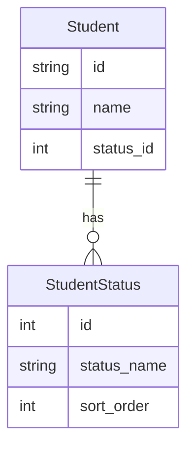

# 課題 1

## 解答 1

- 既にテーブルに値が入っていた場合、Check 対象となるワードを追加することが難しい
- status カラムで任意の順にソートさせることが難しい
- 卒業日、停学期間などの情報を追加で保存したい場合に対応できない

# 課題 2

## 解答 2

- status についての参照テーブルを用意する

# 課題 3

## 解答 3

- SNS のユーザー管理システム：ユーザーのアカウント状態（アクティブ、休止中、バン など）を単一のカラムで管理しようとする場合。
    - 状態の追加や変更、各状態に関連する詳細情報の管理が複雑になる。