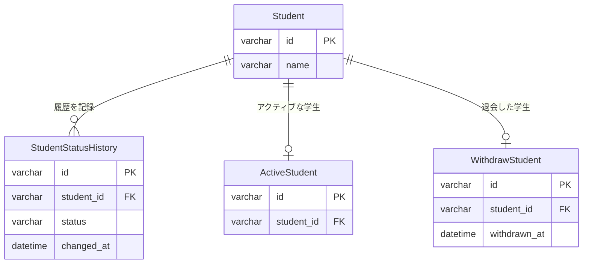

## 解答 1　とりあえず削除フラグ

- クエリ時に削除済みと未削除の条件分岐が必要になる
- ユーザー数の増加に伴い、インデックスの効率が低下する
    - taikaiFlag は基本的に「true」または「false」の 2 値しか取らないため、データの多様性が低く、インデックスの効果が限定的になる

## 解答 2

「Student テーブル」、「StudentStatusHistory」テーブル、「ActiveStudent」テーブル、「WithdrawStudent」テーブルにテーブルを分割する。

# 課題 3

### 課題 3-1

「注文を行った」、「注文の後、対象の注文について取り消し手続きを行った」２つの事柄がデータベース上から削除されてしまい、後からの照合が困難になる。

### 課題 3-2

- Student に紐づいたテスト成績や出席記録のデータが取得できなくなってしまう恐れがある
    - student_id で正規化されたテーブルに、JOIN できなくなったレコードが生まれてしまう
- 再入会した際、Student テーブルから値を復元できずに再登録が必要となってしまうかも

### 課題 3-3

分析を行い、結果をエクセルで出力する機能を持ったシステムを管理していましたが、

そのシステムについては物理削除をしたものがあっても運用上は特に問題ありませんでした。

システム仕様としては、データベース上で分析結果のファイルパスを蓄積しておき、

ファイル DL 時にそのパスを参照してクライアントにファイルを渡すようにしていましたが、

分析ケースを削除する時は、ファイル削除と同時に保存先パスのレコードも物理削除するようにしていました。

この時は、仮にもう一度同じファイルを作成したい場合は過去の実行履歴から同じ分析を再現することができたので、物理削除が問題にはなりませんでした。