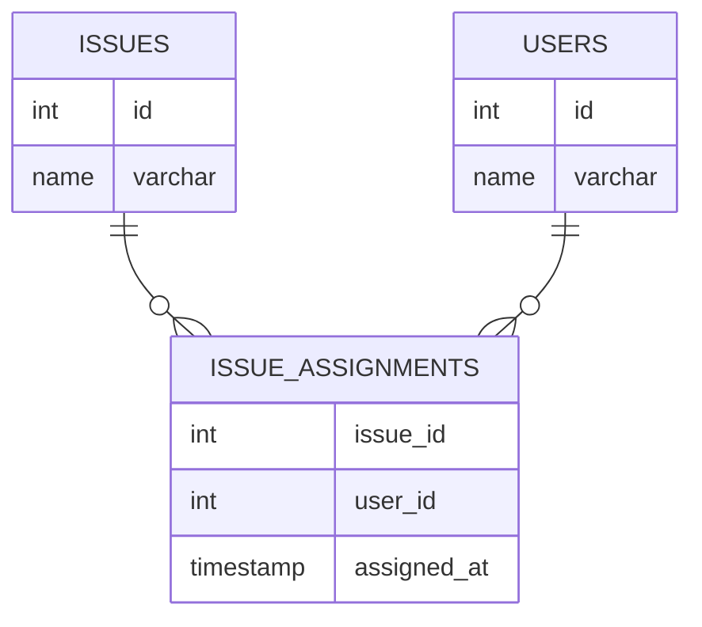

## 課題 1

### 解答 1

|クエリ|実行結果|
|---|---|
|NULL = 0|NULL|
|NULL = NULL|NULL|
|NULL <> NULL|NULL|
|NULL AND TRUE|NULL|
|NULL AND FALSE|FALSE|
|NULL OR TRUE|TRUE|
|NULL IS NULL|TRUE|
|NULL IS NOT NULL|FALSE|

[playground](https://www.db-fiddle.com/) で検証ができる（右側の Query SQL からクエリを入力する）

気になったこと：

- `NULL AND TRUE` は NULL だけど、 `NULL AND FALSE` は FALSE になる
- `NULL OR TRUE` は TRUE になる
- NULL を含むカラムは、サブクエリで `IS NULL` して NULL 値を除外させてから処理したほうがよさそう

[MySQL, PostgreSQLのnullに関する比較](https://zenn.dev/yuma_ito_bd/articles/20240128-rdbms-null)

[SQL における NULL との比較](https://zenn.dev/indigo13love/articles/b3604502149b2f)

## 課題 2

### 解答 2

Assignee と Issue 間に多対多テーブルを作成する。



```sql
CREATE TABLE issue_assignments (
    issue_id INT NOT NULL,
    user_id INT NOT NULL,
    assigned_at TIMESTAMP NOT NULL DEFAULT CURRENT_TIMESTAMP,
    PRIMARY KEY (issue_id, assignee_id),
    FOREIGN KEY (issue_id) REFERENCES issues(id),
    FOREIGN KEY (assignee_id) REFERENCES users(id)
);
```

**NULL はテーブルに存在してよいか？**

- NULL があるということは、正規化ができていないということ
- NULL は許容してもよいが、なぜ NULL が必要になっているか？ということを開発者に共有できるようにしておきたい。
    - NULL が必要なケース：
        - ユーザーの住所や電話番号が必須入力ではない場合は NULL
        - 注文の配送日が未定の場合、NULL を使用する

## 課題 3

### 解答

NULL でなければよいというわけではなく、正規化が十分にできているかを考える必要がある。たとえば、 名前カラムにデフォルトで空文字列が入った場合、未入力なので空文字列なのか？後から空文字に変更したのか？という２つの意味が生じてしまう。

NULL も、IS NULL を使うことで値が未入力かどうかを判断できる材料になるので、適切に使いどころを考えないといけない。

## 課題 4-1

データベースにおける「NULL」に関する [クイズ](https://www.notion.so/0b1e9517d2a0444597b265308f93d87f?pvs=21) を 3 問作成してみてください。

- COALESCE() 関数の挙動を教えてください
- NULL 値を含む列に対して INDEX を作成することはできますか？
- NULL 値を含む列に対して JOIN する場合、NULL 値が除外されて結合される可能性があるのはどの JOIN でしょうか？
- NULL 値を含む列に対して DISTINCT した場合、NULL レコードはどうなりますか？