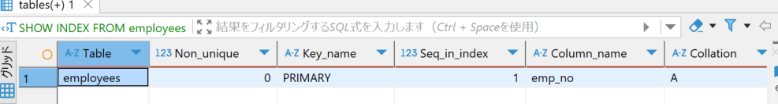

## 1-1 インデックスの仕組みを初心者に伝えるなら？

データベースインデックスは、データベーステーブル内のデータを素早く検索・アクセスするための補助的なデータ構造です。
実世界で例えると、本の索引（インデックス）と同じような役割を果たします。

インデックスがない場合、データベースはテーブル全体をスキャン（フルテーブルスキャン）する必要がありますが、インデックスを使用すると目的のデータに直接アクセスできます。

また、多くの RDBMS で使用されているインデックス構造は B-Tree または B+Tree です。MySQL の InnoDB エンジンは B+Tree を採用しています。

B-Tree のデータ構造の概要としては下記になります。
- **バランスツリー**: 全てのリーフノードが同じ深さを持つ
- **多分岐**: 各ノードは複数の子ノードを持つことができる
- **ノード内のキー**: 昇順でソートされている
- **自己調整**: データの追加・削除に応じて自動的にバランスを保つ

データ検索・アクセス時に、B-Tree 構造を用いた検索アルゴリズムをＤＢエンジンが実行することで、効率的なデータ処理ができるようになります。

なお、DB エンジンによる検索処理の効率は、検索条件によって違いがあります。
具体的には下記表のようになります。

| 検索条件                       | インデックス効率 | 説明                      |
| -------------------------- | -------- | ----------------------- |
| 等価検索 (`=`)                 | 高        | キーと完全一致するデータを直接探索       |
| 範囲検索 (`>`, `<`, `BETWEEN`) | 中〜高      | B+Tree のリーフノードのリンクにより効率的 |
| 前方一致 (`LIKE 'abc%'`)       | 中〜高      | ツリー構造を使った検索が可能          |
| 後方一致 (`LIKE '%xyz'`)       | 低        | インデックスを効果的に使用できない       |
| 中間一致 (`LIKE '%xyz%'`)      | 低        | インデックスを効果的に使用できない       |

## 1-2 インデックスを貼る基準はあるか？

データベースのインデックスを貼ることで検索クエリの高速化が可能になるが、副作用やコストも伴う。
このトレードオフを理解した上で、インデックス設計の判断を行うことが重要になる。

また、 INSERT、UPDATE、DELETE のような書き込み処理を行うと、インデックスの再構成が実行される。この処理は、インデックス列を増やすほどコストも大きくなる。

- INSERT
	- インデックスページの書き込み
	- B ツリーのバランスを保つための再構築
- UPDATE(インデックス列の更新の場合)
	- インデックスの削除と再挿入
	- 複合インデックスの場合
		- 全てのインデックス列が更新される
- DELETE
	- インデックスエントリの削除
		- インデックスの断片化につながる

効果的にインデックスを貼るためには、
- スロークエリログを確認
- 読み取り/書き込み操作の比率に注意
	- 書き込みが多い場合はインデックスを最小限に抑える
- 断片化のチェック
これらを意識したパフォーマンスチューニングが必要である。

## 1-3 カーディナリティとは？

カーディナリティ（Cardinality）とは、あるカラムに含まれる一意な値（ユニークな値）の数を指す。

値の重複率を相対カーディナリティと呼び、MYSQL で下記の SQL クエリから確認できる。

```sql
SHOW INDEX FROM table_name;
```

このクエリを実行すると、`Cardinality` 列に各インデックスの推定カーディナリティが表示される。ただし、これは統計情報に基づく推定値なので、実際の値の表示ではない。

相対カーディナリティが高く、ほとんどの値がユニークなインデックスは、検索パフォーマンスが高い。
逆に、true/false など、値の取り得る範囲が少ないカラムの場合、インデックスを使っても多くのレコードにアクセスして確認が必要になる。

## 1-4 カバリングインデックスとは？

カバリングインデックスとは、クエリを処理するために必要なすべての情報をインデックス自体から取得できるように設計されたインデックスのこと。これによって、データテーブル本体へのアクセス（ルックアップ）が不要になる。

具体的には、通常のインデックス検索では、
1. インデックススキャンにより対象レコードを特定
2. データテーブルに戻って必要なデータを取得
この２工程が必要だが、カバリングインデックスを使用した場合は 1.の段階でクエリを完了させることができる。

カバリングインデックス作成のサンプルコード：

```sql
-- 作成例: user_idでフィルタリングし、email, nameを取得するクエリ対応
CREATE INDEX idx_user_covering 
ON users (user_id, email, name);

-- このインデックスを使用するクエリ
SELECT email, name 
FROM users 
WHERE user_id = 123;
```

カバリングインデックスが使用されると、EXPLAIN の `Extra` カラムに「Using index」という表示がされる：

```sql
mysql> EXPLAIN SELECT email, name FROM users WHERE user_id = 123;
+----+-------------+-------+------+---------------+----------------+---------+-------+------+-------------+
| id | select_type | table | type | possible_keys | key            | key_len | ref   | rows | Extra       |
+----+-------------+-------+------+---------------+----------------+---------+-------+------+-------------+
|  1 | SIMPLE      | users | ref  | idx_user_covering | idx_user_covering | 4       | const |    1 | Using index |
+----+-------------+-------+------+---------------+----------------+---------+-------+------+-------------+
```

適用のポイントとしては、
- データ書き込み時のインデックス再構築コストが通常インデックスより高い
- 検索クエリのカラムがカバリングインデックスから漏れていると適用されない
	- SELECT, WHERE, ORDER BY, GROUP BY 句の対象カラムから漏れがないように設定する
これらを意識して設計することで、データベースパフォーマンスを向上させることができる。

## 1-5 主キーが auto increment で良いのか？

データベース設計における、プライマリキーの役割は：

- レコードを一意に識別する
- 外部キー関連付けの基盤となる
- インデックスの構造に大きく影響する

自動採番できる主キーとしては、AUTO_INCREMENT と UUID という 2 つの主要なアプローチが用いられており、それぞれの特性を理解し、適切に使い分けることが重要になる。

### AUTO_INCREMENT によるメリット

1. 常に昇順で値が追加されるため、B-Tree 構造のインデックス維持が効率的
2. 整数型（4 バイト）で実装され、ストレージ負荷が少ない
3. 連続した値のため、キャッシュヒット率が高い
4. 実数値なので人間が理解しやすい

### AUTO_INCREMENT によるデメリット

1. 連番のため、値が推測しやすく、セキュリティ上の懸念がある
2. 複数のデータベースノード間で連番を維持するのが困難
3. 異なるシステムのデータをマージする際に競合が発生しやすい
4. 常に末尾にデータが追加されるため、B-Tree の特定部分に負荷が集中する

### UUID

UUID は、グローバルに一意であることを保証する 128 ビット（16 バイト）の識別子。
`a0eebc99-9c0b-4ef8-bb6d-6bb9bd380a11` のような文字列が自動生成される。
具体的には、8 桁のグループが 1 つ、4 桁のグループが 3 つ、12 桁のグループが 1 つの合計 32 桁で 128 ビットの文字列になる。

### UUID が適しているケース

1. **分散システム環境**
    - マイクロサービスアーキテクチャ
    - 地理的に分散したデータベース
2. **データ同期・マージ要件**    
    - 異なるシステム間のデータ統合が必要なケース
    - 例：モバイルアプリとサーバー間の同期、クラウド連携サービス
3. **セキュリティ要件**    
    - ID の予測を防止したい場合
    - URL 等で外部公開される ID

### AUTOINCREMENT,UUID 以外の識別子

1. **ULID (Universally Unique Lexicographically Sortable Identifier)**

    ```
    01F8MECHZX3TBDSZ7VQ0T9VW4K
    \_________________/\_______/
           時間         ランダム
    ```

    - タイムスタンプ（48 ビット）+ ランダム部分（80 ビット）
    - 時間順ソート可能

2. **KSUID (K-Sortable Unique IDentifier)**

    ```
    0ujzPyRiIAffKhBux4PvQdDqMHY
    \_____/\________________________/
     時間           ランダム
    ```

    - 4 バイトのタイムスタンプ + 16 バイトのランダム部分

3. **Snowflake ID**

    ```
    637971641536395264
    \_________/\____/\__/
       時間     ワーカー シーケンス
    ```

    - 64 ビット整数値
    - 41 ビットのタイムスタンプ + 10 ビットのマシン ID + 12 ビットのシーケンス番号
    - Twitter が開発し、分散システムでよく使用される

## 2-1 select クエリの実行時間計測

```txt
200 row(s) fetched - 0.021s (0.010s fetch), on 2025-04-12 at 18:54:51
```

## 2-2 インデックスを作成して、再度実行時間計測

インデックスの作成 (9 秒ぐらいで実行完了した)

```sql
CREATE INDEX idx_employees_last_name ON employees (last_name);
```

再度実行すると・・・

```
200 row(s) fetched - 0.010s (0.004s fetch), on 2025-04-12 at 18:58:25
```

- 0.02s → 0.01s になっている

## 2-3 ボリューム作り直して、再度実行時間計測

作り直し　1 回目
- インデックスは貼られていない

- もう一度インデックスを作る
- 検索クエリを実行

```txt
200 row(s) fetched - 0.015s (0.008s fetch), on 2025-04-12 at 19:09:20
```

作り直し 2 回目
- もう一度インデックスを作る
- 検索クエリを実行
- 1

```
200 row(s) fetched - 0.012s (0.005s fetch), on 2025-04-12 at 19:22:25
```

- 2

```
200 row(s) fetched - 0.011s (0.004s fetch), on 2025-04-12 at 19:22:46
```

- 3

```
200 row(s) fetched - 0.010s (0.003s fetch), on 2025-04-12 at 19:23:10
```

- 4

```
200 row(s) fetched - 0.008s (0.002s fetch), on 2025-04-12 at 19:23:18
```

- 5

```
200 row(s) fetched - 0.010s (0.002s fetch), on 2025-04-12 at 19:23:27
```

### なぜ実行時間が短くなるか？

MySQL のキャッシュ機能によって実行時間が短くなる。
MYSQL が提供するキャッシュ機能は、２つの仕組みが働いている：

1. **バッファプール**：
    - InnoDB エンジンはディスクからデータを読み込む際、そのデータをメモリ上の「バッファプール」と呼ばれる領域にキャッシュします
    - 最初のクエリ実行時にディスクからデータを読み込みますが、2 回目以降はメモリ上のバッファプールから高速にデータを取得できます
    - メモリアクセスはディスクアクセスに比べて数千〜数万倍速い
2. **クエリキャッシュ**：
    - 同じ SQL クエリが実行された場合、その結果セットをメモリにキャッシュする場合がある

## 3-1 実行に 10 秒以上かかる SELECT クエリを考える

- 33 秒かかった

```sql
SELECT e.emp_no, e.first_name, e.last_name, d.dept_name, 
       MAX(s.salary) as max_salary,
       COUNT(t.title) as title_count
FROM employees e
JOIN dept_emp de ON e.emp_no = de.emp_no
JOIN departments d ON de.dept_no = d.dept_no
JOIN salaries s ON e.emp_no = s.emp_no
JOIN titles t ON e.emp_no = t.emp_no
WHERE e.hire_date BETWEEN '1985-01-01' AND '1995-12-31'
GROUP BY e.emp_no, e.first_name, e.last_name, d.dept_name
ORDER BY max_salary DESC, e.last_name ASC;
```

- 13 秒かかった

```sql
SELECT d.dept_name, 
       AVG(s.salary) as avg_department_salary,
       MIN(s.salary) as min_salary,
       MAX(s.salary) as max_salary,
       COUNT(DISTINCT e.emp_no) as employee_count,
       SUM(CASE WHEN e.gender = 'M' THEN 1 ELSE 0 END) as male_count,
       SUM(CASE WHEN e.gender = 'F' THEN 1 ELSE 0 END) as female_count
FROM departments d
JOIN dept_emp de ON d.dept_no = de.dept_no
JOIN employees e ON de.emp_no = e.emp_no
JOIN salaries s ON e.emp_no = s.emp_no
WHERE s.from_date BETWEEN '1985-01-01' AND '2000-12-31'
  AND e.birth_date > '1950-01-01'
  AND e.last_name NOT LIKE 'A%'
GROUP BY d.dept_name
ORDER BY avg_department_salary DESC, employee_count DESC;
```

- 28 秒かかった

```sql
SELECT e.emp_no, e.first_name, e.last_name, 
       d.dept_name, t.title,
       AVG(s.salary) as avg_salary
FROM employees e
JOIN dept_emp de ON e.emp_no = de.emp_no
JOIN departments d ON de.dept_no = d.dept_no
JOIN titles t ON e.emp_no = t.emp_no
JOIN salaries s ON e.emp_no = s.emp_no
WHERE e.hire_date BETWEEN '1980-01-01' AND '2000-12-31'
  AND t.from_date > '1990-01-01'
GROUP BY e.emp_no, e.first_name, e.last_name, d.dept_name, t.title
HAVING avg_salary > 50000
ORDER BY avg_salary DESC;
```

## 3-2 3-1 のクエリをインデックスによって高速化する

### インデックスを貼ってみる

where 条件に指定している `hire_date` にインデックスをかけてみる

```sql
CREATE INDEX idx_employees_hire_date ON employees (hire_date);
```

34 秒かかった（時間が増えている）

```
200 row(s) fetched - 34s (0.001s fetch), on 2025-04-12 at 20:08:25
```

GROUP BY に指定しているカラムもインデックスを貼ってみる

```sql
CREATE INDEX idx_dept_emp_emp_no ON dept_emp (emp_no);
CREATE INDEX idx_dept_emp_dept_no ON dept_emp (dept_no);
CREATE INDEX idx_salaries_emp_no ON salaries (emp_no);
CREATE INDEX idx_titles_emp_no ON titles (emp_no);
```

33 秒かかった（変わっていない・・・）

```
200 row(s) fetched - 33s (0.001s fetch), on 2025-04-12 at 20:11:49
```

実行計画を確認してみると、`employees` テーブルに対して `ALL`（フルテーブルスキャン）されているのが原因のようだった。
また、`Using temporary; Using filesort` とも表示されており、フルテーブルスキャンでインデックスが効いていないため、処理時間が大きくなっていそう。

### クエリから集計関数を消してみる

以下のクエリで、MAX(), COUNT() を使わないようにすると、処理時間は 16 秒まで減った。

```sql
SELECT e.emp_no, e.first_name, e.last_name, d.dept_name
FROM employees e
JOIN dept_emp de ON e.emp_no = de.emp_no
JOIN departments d ON de.dept_no = d.dept_no
JOIN salaries s ON e.emp_no = s.emp_no
JOIN titles t ON e.emp_no = t.emp_no
WHERE e.hire_date BETWEEN '1985-01-01' AND '1995-12-31'
GROUP BY e.emp_no, d.dept_name, e.last_name, e.first_name
ORDER BY e.last_name ASC;
```

### インデックスを適用させてみる

```sql
SELECT e.emp_no, e.first_name, e.last_name, d.dept_name
FROM employees e FORCE INDEX (idx_employees_hire_date) -- FORCE追加
JOIN dept_emp de ON e.emp_no = de.emp_no
JOIN departments d ON de.dept_no = d.dept_no
JOIN salaries s ON e.emp_no = s.emp_no
JOIN titles t ON e.emp_no = t.emp_no
WHERE e.hire_date BETWEEN '1985-01-01' AND '1995-12-31'
GROUP BY e.emp_no, d.dept_name, e.last_name, e.first_name
ORDER BY e.last_name ASC;
```

`FORCE INDEX` によって、インデックスが効くようにしてみた。
`EXPLAIN` をつけて確認してみたところ、
`type:ALL, rows:299069` → `type:range, rows:149534` となり、スキャンレコード数が半分まで減っていた。

だが、実行時間は 1 秒程度しか削減できておらず・・・
どちらかといえば、GROUP BY の指定数がボトルネックになっているようだった。

## 3-3 チームの人の SELECT クエリを見比べる

## 4-1 複合インデックスの仕組みを初心者に説明する

複合インデックスは、2 つ以上のカラムを組み合わせて作成されるインデックスです。

特徴としては：
- インデックスの左端のカラム（先頭カラム）から順に使用される
- WHERE 句の条件、結合条件、ORDER BY、GROUP BY などに使用可能
- クエリで指定されたカラムの順番が一致しないと使用されない

複合インデックスでは、カラムの順序が非常に重要です。例えば、`(last_name, first_name)` のインデックスは：

- `last_name` のみの検索に使用できる
- `last_name, first_name` の組み合わせ検索に使用できる
- しかし、`first_name` のみの検索には使用できない

これは leftmost prefix と呼ばれます。インデックス設計時には、最も頻繁に検索に使用されるカラムを左側に配置するのが一般的です。

## 4-2 姓、名を複合インデックスで作る場合の注意

性：last_name, 名：first_name なので、

```sql
CREATE INDEX employees_name ON employees (first_name, last_name)
```

この複合インデックスだと、
- 姓だけの検索：インデックス無し
- 名だけの検索：インデックス有り
- 姓、名の検索：インデックス有り（検索クエリの順番が崩れていなければ）
となる。

