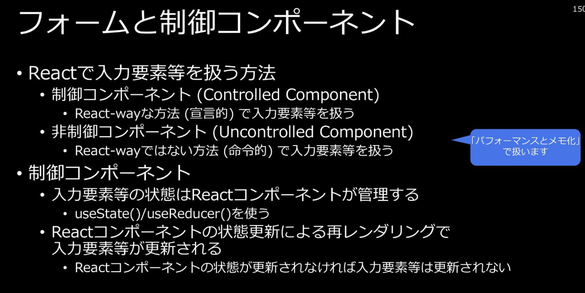
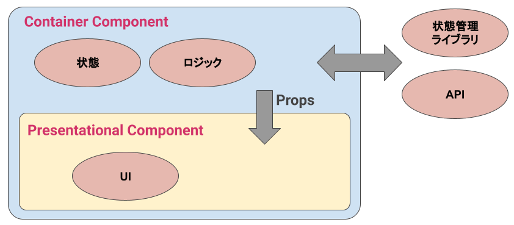
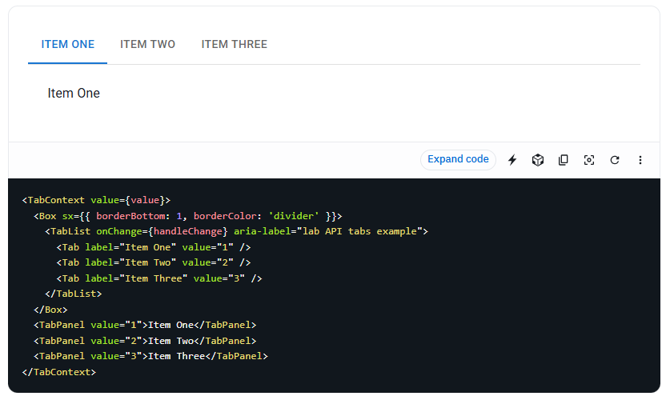
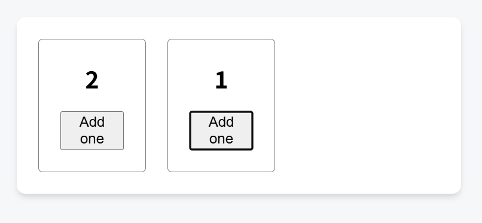

## 課題1-1

### 「制御コンポーネント」と「非制御コンポーネント」について、どのようなコンポーネントが「制御」「非制御」であるべき？

制御、非制御コンポーネントについて、以下と定義する：

- 制御コンポーネントはReactが「フォーム要素の状態」を管理する
- 非制御コンポーネントはDOM 自身が「フォーム要素の状態」を管理する

制御コンポーネントを用いるタイミングは、**ユーザーの入力値をReact State値として扱いたいとき**。例えば、入力値をリセットするボタンを別コンポーネントに置くときや、キーボードの数値入力以外にスライダーでも値を設定できる・・・等。少し複雑なことをReactで表現したい場合、制御コンポーネントを使うことになる。

非制御コンポーネントを用いるタイミングは、Reactを使わずに、HTMLまたはCSSで動作の表現が可能なとき。例えば、シンプルなフォームコンポーネントで、入力内容をsubmitで受け付けるだけ、onChangeなどのイベントハンドラを使わない場合など。

非制御コンポーネントを使うメリットとしては、不要な再レンダリングを防ぐことができる、というところ。

コンポーネントを非制御にしていなかったからパフォーマンスに困ってしまった、という場面に遭遇することはあまり多くない。非制御かどうかにはこだわりすぎず、**コンポーネントの処理構造をシンプルに保つ**ことを優先し、コンポーネント全体が複雑で再レンダリングがあまりにも多い、という場合は一部を非制御コンポーネントとして切り出す、くらいのスタンスで良さそう。

また、`react-hook-form`のような、非制御コンポーネントでもフォーム内容の変更が検知できるライブラリも存在する。外部ライブラリを選定する上での観点の一つとしてcontrolledなのか、uncontrolledなのかを意識しておくと、選定基準が明確になるかも

#### 参考

[フォーム – ja.legecy.reactjs](https://ja.legacy.reactjs.org/docs/forms.html#controlled-components)

>制御されたコンポーネント:HTML では `<input>`、`<textarea>`、そして `<select>` のようなフォーム要素は通常、自身で状態を保持しており、ユーザの入力に基づいてそれを更新します。React では、変更されうる状態は通常はコンポーネントの state プロパティに保持され、setState() 関数でのみ更新されます。
React の state を “信頼できる唯一の情報源 (single source of truth)” とすることで、上述の 2 つの状態を結合させることができます。そうすることで、フォームをレンダーしている React コンポーネントが、後続するユーザ入力でフォームで起きることも制御できるようになります。このような方法で React によって値が制御される入力フォーム要素は「制御されたコンポーネント」と呼ばれます。

古いバージョンのreactドキュメントは、フォーム要素にstateを持つコンポーネントのことを制御コンポーネントと定義している

[制御されたコンポーネントと非制御コンポーネント - ja.react.dev](https://ja.react.dev/learn/sharing-state-between-components#controlled-and-uncontrolled-components)

>一般的に、ローカル state を持つコンポーネントを “非制御 (uncontrolled)” であると呼びます。例えば、isActive という state 変数を持つ元の Panel コンポーネントは、パネルがアクティブかどうかに関して親が影響を与えることができないため、非制御コンポーネントです。
対照的に、重要な情報がローカル state ではなく props によって駆動されるとき、コンポーネントは “制御された (controlled)” ものと呼ばれることがあります。

新しいバージョンのreactドキュメントは、渡されたpropsの変更を検知して再レンダリングするコンポーネントのことを制御されたコンポーネントと定義している

[React 研修 (2024) - Speaker Deck](https://speakerdeck.com/recruitengineers/react-yan-xiu-2024?slide=144)



>制御コンポーネント：宣言的、非制御コンポーネント：命令的

[非制御コンポーネントと制御コンポーネント、どれくらいパフォーマンス差がある？ #初心者 - Qiita](https://qiita.com/musenmai/items/fa26deb91c445bead4a2)

>こちらのコードで試してみたところ、Controled Componentではフォームの値を変更するたびに、0.01〜0.02秒かかっていることが確認できました。

>結論：一定の条件下において、非制御コンポーネントの方がパフォーマンスが良くなるというのは事実であることが確認できました。ですが、１つのコンポーネントあたりのフォーム数が少ない場合、大きな違いはなくなりそうです。

[React Hook Formは非制御コンポーネントからどうやって変更を検知しているのか - Commune Engineer Blog](https://scrapbox.io/kmishima/41_React%E3%81%AB%E5%85%A5%E9%96%80%E3%81%97%E3%82%88%E3%81%86%E3%80%90%E7%8A%B6%E6%85%8B%E7%AE%A1%E7%90%86%E7%B7%A8)

>refに渡すregister関数について調べたいので、useFormのコードを調べます。 useFormのコードは/src/useForm.tsにあります。
useForm.tsの1042~1074行目にregister関数の実装が見つかります。 register関数の中では必ずregisterFieldRef関数が呼ばれています。 registerFieldRef関数にはregister関数が受け取ったrefを渡しているようです。

## 課題1-2

### Container/Presentationalパターンについてまとめてください

ロジックとUIを分けて実装することで関心の分離を図るフロントエンドのデザインパターン。
- Container Component: ロジックを責務
- Presentational Component: UIを責務とする

以下のようなメリットが有る。
- ロジックとUIが分かれているので、テストが書きやすい。
- Presentational Componentはpropsから渡されるデータのみに依存しているので、シンプルな構造になる。

#### 参考

 [Container/Presentationalパターン再入門](https://zenn.dev/buyselltech/articles/9460c75b7cd8d1)



[コンテナ・プレゼンテーションパターン｜フロントエンドのデザインパターン](https://zenn.dev/morinokami/books/learning-patterns-1/viewer/presentational-container-pattern)

>プレゼンテーションコンポーネントは、データを変更することなく表示するだけなので、再利用が容易です。アプリケーション全体で、異なる目的のためにプレゼンテーションコンポーネントを再利用することができます。

>プレゼンテーションコンポーネントはアプリケーションロジックを変更しないため、デザイナーのようにコードベースの知識がない人でも、簡単にプレゼンテーションコンポーネントの外観を変更することができます。プレゼンテーションコンポーネントがアプリケーションの多くの箇所で再利用される場合、その変更はアプリケーション全体で一貫したものとなるはずです。

>プレゼンテーションコンポーネントは通常、純粋関数であるため、テストが容易です。入力となるデータからコンポーネントが何をレンダリングするかを知ることができ、データストアをモックしなくてよいのです。

### 「Composition」パターンについてまとめてください

Compositionパターンは、依存関係を持たない(もしくは少ない)、独立したコンポーネントを組み合わせて使うパターン。

このパターンをもとに設計されたコンポーネントは、関心ごとに中身が細かく分離されたものになる。

例えば、Cardコンポーネントであれば、一つのCardコンポーネントのまとまりではなく、Cardという親コンポーネントと、タイトル・コンテンツ・ボタンの３つの子コンポーネントに分解することを検討するなど。親のCard側で宣言されているstateと関係ない子コンポーネントを分離して、疎結合な親子関係を目指す。

以下はMaterial UIのTabコンポーネントを使っている例だが、親の`Tabs`コンポーネントの責務は、子として`TabList`,`TabPanels`を持つこと、子の`TabList`と`TabPanels`はそれぞれの責務をもたせる・・・といった形で抽象化されたコンポーネントが組み合わさっており、Compositionパターンの具体例といえる。

```jsx
function App() {
  return (
    <Tabs defaultActiveTab="tab1">
      <TabList>
        <Tab id="tab1">Tab 1</Tab>
        <Tab id="tab2">Tab 2</Tab>
      </TabList>
      <TabPanels>
        <TabPanel id="tab1">Content for Tab 1</TabPanel>
        <TabPanel id="tab2">Content for Tab 2</TabPanel>
      </TabPanels>
    </Tabs>
  );
}
```

#### 具体例

[Compositionパターン - Next.jsの考え方](https://zenn.dev/akfm/books/nextjs-basic-principle/viewer/part_2_composition_pattern)

>そのため、React Server Componentsにおいては設計する順番も非常に重要です。画面を実装する段階ではまずデータフェッチを行うServer Componentsを中心に設計し、そこに必要に応じてClient Componentsを末端に配置したりCompositionパターンで組み込んで実装を進めていくことを筆者はお勧めします。

NextJSにおける、ServerコンポーネントとClientコンポーネントを組み合わせの文脈でCompositionパターンが推奨されている。大きな１つのClinetコンポーネントではなく、親となるClientコンポーネントと、子のServerコンポーネントの組み合わせにすることでレンダリングの負荷をServer側に寄せることができる。

[Tabs - MUI](https://mui.com/material-ui/react-tabs/)



## 課題2-1

### 「Reactに入門しよう【レンダリング編】」の課題で実装したTODOリストをリファクタしてみてください。

useReducerを使いリファクタすることで、action単位でのstateを操作をひとまとめにできるようになり、ロジックが集約された。

```jsx
function reducer(state: State, action: Action): State {
  switch (action.type) {
    case 'SET_INPUT':
      return { ...state, inputValue: action.payload }
    case 'ADD_TODO':
      if (state.inputValue.trim() === '') return state
      const newTodo: Todo = {
        id: Date.now(),
        text: state.inputValue
      }
      return {
        todos: [...state.todos, newTodo],
        inputValue: ''
      }
    case 'DELETE_TODO':
      return {
        ...state,
        todos: state.todos.filter(todo => todo.id !== action.payload)
      }
    default:
      return state
  }
}
```

### 「button要素をクリックしたときにinput要素に入力されているtitleを取得する」ユースケースにおいて、非制御コンポーネントの場合、title, setTitleのようなstateを使う必要はありません。どのような実装になるでしょうか？

useRefを使うことで、課題文の要求を満たしたbutton要素を作れる

```jsx
function App() {
  const inputRef = useRef<HTMLInputElement>(null)

  const handleClick = () => {
    if (inputRef.current) {
      const title = inputRef.current.value
      // ここでtitleを使った処理
    }
  }

  return (
    <div>
      <input type="text" ref={inputRef}/>
      <button onClick={handleClick}>実行</button>
    </div>
  )
}
```

## 課題2-2

### TODOのstateや操作のメソッドを、reducerやcontextを使って整理してみましょう

今回のTODOリスト機能はpropsを介した受け渡しを行わないので、reducerが適していると判断した。

コミット：https://github.com/kmishima16/praha-todo/commit/d613e276372139eff5e29c5a6541fe76fd538f4f

## 課題2-3

### TODOリストに「TODOを編集する」「TODOの順番を入れ替える」機能を追加してみてください。

コミット：https://github.com/kmishima16/praha-todo/commit/616829aa2171c99c0c1526e4463cb6fd89c324dc

## 課題3-1

### React状態管理に関するクイズ

以下のような、カウンターを２つ並べたコンポーネントがあります。

```jsx
export default function App() {
  const counter = <Counter />;
  return (
    <div>
      {counter}
      {counter}
    </div>
  );
}
```

counterの内部にはscoreというstateがあり、それぞれカウントアップすることができます。



Reactはどういう仕組みでそれぞれのstateを管理しているか、以下の言葉を穴埋めしてみてください。


#### 穴うめ

Reactは、コンポーネントがレンダリングされる[  ]に基づいて、それぞれのインスタンスを区別します。これにより、同じコンポーネントから生成された複数のカウンターが、それぞれ独立したstateを持つことができます。


#### 答え

ツリー上の位置