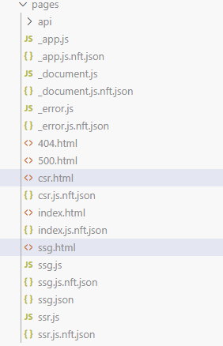

## 課題1

> CSR, SSR, SSGのそれぞれについて概要・メリット・デメリットを説明してください

### Client-Side Rendering (CSR)

概要:

CSRでは、ユーザーのブラウザがHTML、CSS、JavaScriptなどの初期ファイルをダウンロードした後、JavaScriptを実行してページのコンテンツ全体を動的に生成・表示します。サーバーは最小限のHTML（通常は空のHTMLファイル）を返し、データ取得やDOM操作はすべてブラウザ側で行われます。

メリット:

- サーバー負荷の軽減

デメリット:

- 初期表示速度の遅延
- SEOの課題: クローラーがJavaScriptを実行できない場合がある

### Server-Side Rendering (SSR)

概要:

ユーザーからのリクエストごとに、サーバーがページのコンテンツをすべて生成し、完全にレンダリングされたHTMLをブラウザに返す。

メリット:

- ブラウザはHTMLをそのまま表示できる
- 低速なネットワークやデバイスでも読込が早い

デメリット:

- サーバーが負荷がCSRよりかかる
- 開発者の負担：CSR,SSRの切り分けを意識する必要がある

### Static Site Generation (SSG)

概要:

ビルド時にすべてのページのHTMLファイルを事前に生成する。コンテンツの変更がない限り、ビルドされた静的なHTML、CSS、JavaScriptファイルを配信する。

メリット:

- 事前に生成された静的ファイルを配信するため、サーバー側での処理が不要
- CDNに静的ファイルをホスティングできる：運用費を抑えられる

デメリット:

- 動的なコンテンツに不向き: 状態に応じたコンテンツの出し分けなどが難しい
- ビルド時間: 規模が大きくなると、ビルドに時間がかかる

## 課題2

> Next.jsの「Pages Router」を使用する

## 課題2-1

> ターミナルで`npx create-next-app@latest` を実行して新しいNext.jsアプリケーションを作ってください。

https://github.com/kmishima16/praha-next/commit/a3c5c152eb9666309aa53971d77fb9859c914a2b

## 課題2-2

> 課題2-1で作ったアプリケーションにcsr.tsxというファイルを追加してください。ファイルの中身はindex.tsxをコピーするだけでOKです。

https://github.com/kmishima16/praha-next/commit/4900a73566534c9beb6e978ebbbf0fca0af50a63

## 課題2-2-1

> 作ったcsr.tsxに`https://jsonplaceholder.typicode.com/posts/1`というAPIを叩いて取得できるデータを表示してください。このときクライアント側でデータが取得されるようにしてください。

https://github.com/kmishima16/praha-next/commit/c3aca059e3dfa4147ecb9389a05fc2d813422bf6

>ブラウザの開発者ツールで配信されたHTMLファイルを見てみるといいかもしれません、HTMLファイルの中身はどうなっているでしょうか？

以下の部分について、初期状態は、pタグのLoadingになっているが、fetchが終わったらpタグの中身が変化したことを確認した

```jsx
<p>{data ? `title: ${data.title}` : 'Loading...'}</p>
```

```html
// before
<p>Loading...</p>

// after
<p>title: sunt aut facere repellat provident occaecati excepturi optio reprehenderit</p>
```

## 課題2-2-2

> ssr.tsxというファイルを追加してください。
ssr.tsxでも同様にAPIから取得したデータを表示してください。このときサーバー側でデータが取得されるようにしてください。
作ったssr.tsxがSSRで描画されていることを確認してください。

https://github.com/kmishima16/praha-next/commit/d13ed7ced045e0bb04068b2ac35b8af0adb3c7d7

`GetServerSideProps`を使い、サーバ側でデータfetchするようにしている

ページが読み込まれた時点でfetch後のpタグになっていることを確認した

```html
<p>title: sunt aut facere repellat provident occaecati excepturi optio reprehenderit</p>
```

```jsx
import { GetServerSideProps } from "next";

export const getServerSideProps: GetServerSideProps<Props> = async () => {
  try {
    const response = await fetch('https://jsonplaceholder.typicode.com/posts/1');
    if (!response.ok) {
      throw new Error(`HTTP error! status: ${response.status}`);
    }
    const result = await response.json();
    return { props: { data: result } };
  } catch (e) {
    console.error('An error occurred while fetching the data: ', e);
    return { props: { data: null } };
  }
};
```

## 課題2-2-3

> ssg.tsxというファイルを追加してください
ssg.tsxでも同様にAPIからデータを表示してください。このときアプリケーションのビルド時にデータが取得されるようにしてください。

https://github.com/kmishima16/praha-next/commit/c4709518ad41e77dfaaa3319010c0bf484e03bd3

`GetStaticProps`を使い、サーバ側でデータfetchするようにしている

```jsx
import { GetStaticProps } from "next";

export const getStaticProps: GetStaticProps<Props> = async () => {
  try {
    const response = await fetch('https://jsonplaceholder.typicode.com/posts/1');
    if (!response.ok) {
      throw new Error(`HTTP error! status: ${response.status}`);
    }
    const result = await response.json();
    return { props: { data: result } };
  } catch (e) {
    console.error('An error occurred while fetching the data: ', e);
    return { props: { data: null } };
  }
};
```

## 課題2-3

>アプリケーションを`npm run build`でビルドしてください。
各ページをビルドした成果物は .next/server/pages ディレクトリに出力されているはずです。

```terminal
Route (pages)                                Size  First Load JS    
┌ ○ /                                     5.41 kB        97.6 kB
├   /_app                                     0 B        92.2 kB
├ ○ /404                                    180 B        92.4 kB
├ ƒ /api/hello                                0 B        92.2 kB
├ ○ /csr (306 ms)                           745 B        92.9 kB
├ ● /ssg (374 ms)                           587 B        92.8 kB
└ ƒ /ssr                                    583 B        92.8 kB
+ First Load JS shared by all             95.1 kB
  ├ chunks/framework-7c95b8e5103c9e90.js  57.7 kB
  ├ chunks/main-086ad378b014fb6a.js       33.4 kB
  └ other shared chunks (total)           3.97 kB

○  (Static)   prerendered as static content
●  (SSG)      prerendered as static HTML (uses getStaticProps)
ƒ  (Dynamic)  server-rendered on demand
```

/ssg がSSGとして認識されている。

ビルド済みの`ssg.html`を除いてみると、pagePropsにfetch後のデータが格納されていた。

`{"props":{"pageProps":{"data":{"userId":1,"id":1,"title":"sunt aut facere repellat provident occaecati excepturi optio reprehenderit","body":"quia et suscipit\nsuscipit recusandae consequuntur expedita et cum\nreprehenderit molestiae ut ut quas totam\nnostrum rerum est autem sunt rem eveniet architecto"}},"__N_SSG":true},"page":"/ssg","query":{},"buildId":"9tuYybyro4WKi919mKRCl","isFallback":false,"gsp":true,"scriptLoader":[]}</script></body></html>`


> HTMLファイルが生成されているのはどのレンダリングパターンか説明してください。
 それぞれのレンダリングパターンについてHTMLファイルが生成されている理由（もしくは生成されていない理由）を説明してください。

csr.html、ssg.htmlが生成されており、ssr.htmlは生成されていなかった。




> それぞれのレンダリングパターンについてHTMLファイルが生成されている理由（もしくは生成されていない理由）を説明してください

- htmlがある
  - CSR: クライアント側でHTMLを生成するため、最小限のHTMLテンプレートのみ作る
  - SSG: HTMLをビルド時に生成し、静的なファイルとして出力する。
- htmlがない
  - SSR: ユーザーのリクエスト時にサーバーが動的にHTMLを生成するため、ビルド時にはHTMLファイルが作られない。

 ## 課題3

 以下のようなケースでCSR、SSR、SSGのうちどれを採用するべきか説明してみてください

|ユースケース例|レンダリング|採用理由|
|:----|:----|:----|
|週1回更新されるブログ|SSG|更新頻度が低いので、ビルド時間を気にしなくてもよい。静的HTMLにビルドするのでサーバ負荷が小さい|
|ユーザーコメントが追加されるサービス（例：クックパッド）|SSR / CSR |最新コメントを即時に表示したい場合や、SEOを重視する場合はSSRを使う。SEO気にしないならCSRでもよい？|
|freee等の会計サービス|CSR |多機能で複雑なWebアプリ部分はCSR|
|経営指標を管理する社内サービス|CSR |社内サービスのため、SEOなどは気にせずCSR。読込速度やサーバ負荷などが気になるならSSR|
|社内SNS|CSR |多機能で複雑なWebアプリ部分はCSR|

