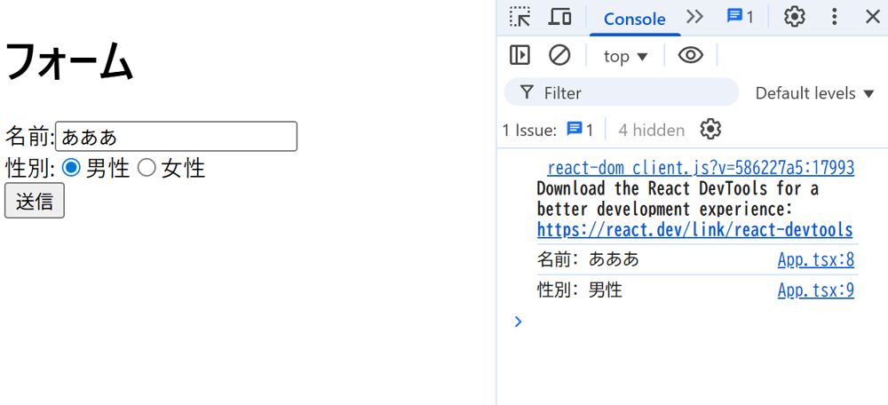

# 44 ライブラリを使ってみよう

>フロントエンドでは様々な機能を実装済みのコンポーネントを提供するもの・便利なカスタムフックを提供するものなど数多くのライブラリが存在します。

>ライブラリを使用することで自前で機能を実装する工数を大きく削減し、よりドメインの実装に集中することができます。

>React Hook Formを使用したフォームの実装を通して、ライブラリの使い方を学習しましょう。

## 1-1 ライブラリを使用せずにフォームを実装しよう

実装要件：

- type=”text”である「名前」を入力する`<input>`要素を持つ
- type=”radio”である「性別」を入力する`<input>`要素を持つ
- type=”button”であるフォームに入力した内容を送信する`<button>`要素を持つ
- `<button>`要素をクリックすると名前と性別がコンソールに出力される

[実装しました](https://github.com/praha-kmishima/44-praha-form/blob/8834d677fe28edf9f36a15fd0c544ff54aa36188/src/App.tsx)

>

## 1-2 追加の要件があります。React Hook Formで実装してみましょう

実装要件：

- 「名前」は入力必須
- 「名前」は最大10文字まで
- 送信した時に上記のいずれかに違反した場合、それを伝えるエラーメッセージが表示される

[実装しました](https://github.com/praha-kmishima/44-praha-form/blob/dad2f24b860cbe8df91e4318cf5842aca09b48f3/src/App.tsx)

>

## 任意課題:実装したフォームが直接React Hook Formに依存しない形にリファクタリングしてみてください

`App.tsx`からフォーム部分のコンポーネントを`components/myProfileForm`に分離し、React Hook Formに依存している箇所は`useCustomForm.ts`というカスタムフックのファイルに分離しました。

before:

```bash
.
 └ src
   └ App.tsx // フォーム機能をここに実装
```

after:

```bash
.
 └ src
 │ └ components
 │  └ myProfileForm
 │     └ index.tsx // フォーム機能をここに実装
 │     └ useCustomForm.ts // React Hook Formのラッパー関数
 └ App.tsx 
```

実装:

- [index.tsx](https://github.com/praha-kmishima/44-praha-form/blob/ffc7566a0efcb2837a4d3e81654658c2197dbe9b/src/components/myProfileForm/index.tsx)
- [useCustomForm](https://github.com/praha-kmishima/44-praha-form/blob/00035aff3841dfb568980a5dc13f609ea63de958/src/components/myProfileForm/useCustomForm.ts)

## 2-1 ライブラリに直接依存しないようにリファクタリングすることは、どのようなメリットがあるのでしょうか？

### メリット

メリットとしては、ライブラリの依存関係を1箇所に集約できることと、テスト容易性が向上することが考えられる。

React Hook Formの`useForm`をインポートしているコンポーネントがカスタムフックの`useCustomForm.ts`のみになるため、ライブラリ変更時に影響が及ぶファイルが少なくなり、テスト実装においてもモック処理が作りやすくなる。

### デメリット

ただし、デメリットとして、インターフェース部分と呼び出し部分で２つのファイルに分割されるため、コード全体としてはファイル数が増え、新たな依存関係が生まれる、という点で複雑さが上がる。

また、ライブラリをラップする関数のインターフェースは独自実装する必要があり、そのためにReact Hook Form本体の型定義や仕様についてある程度理解しなければいけない。

### 設計方針をドキュメントに残す

今回の任意課題のような処理の分解を行う場合は、設計意図を明確にして、抽象レイヤーにあたる`useCustomForm`が適切に運用できていないと将来の技術的負債になる可能性もある。

なぜこのカスタムフックを導入しているのかが第三者的にも理解できるよう、コメントやプルリクエストなどに設計意図をドキュメントとして残す意識が重要である。

## 2-2 要件を実装することが可能なライブラリが複数ある場合、どのようにライブラリを選定するのが良いでしょうか

ライブラリを選定する際は、プロジェクトの要件や開発メンバーの経験値を総合的に評価し、その場面に応じた最適な判断を下せるよう意識する。

### 受託開発なのか内製開発なのか

納期と予算が厳密に決まっている受託開発では、短期的な開発速度と納品後の引き継ぎやすさを重視する。そのため、広く使われていて学習コストが低く、安定して動作する実績豊富なライブラリを選ぶべき。

一方で、長期的にプロダクトを成長させていく内製開発では、長期的な拡張性やメンテナンス性が重要になる。設計の柔軟性やコミュニティの活発さなども加味して判断できるとよい。

### 実装仕様が変わりそうか

仕様が頻繁に変わる可能性がある場合は、特定の機能に特化した小さなライブラリを導入したほうが手戻りを減らしやすい。

多機能なライブラリを使う場合、そのフレームワークの思想から外れるような要件変更には弱く、無理な実装を重ねるとコードも複雑化してしまう、と考えられる。

### リスクと将来性

仮にそのライブラリのメンテナンスが停止した場合、プロジェクトにどのような影響が出るのか。

ライブラリを１年後、３年後、あるいはそれ以上先を見据えて利用し続けられるか、という将来性が意識できているとよい。特定のライブラリへ過度に依存している実装になってしまっていないか、意識しておく必要がある。

### 開発チームの経験値

チーム内にそのライブラリや周辺エコシステムに精通したメンバーがいるかどうか。

ライブラリを採用することで、チームとしてどれだけモチベーションが湧きそうか、組織としてどんな影響があるかも考えると良さそう。
