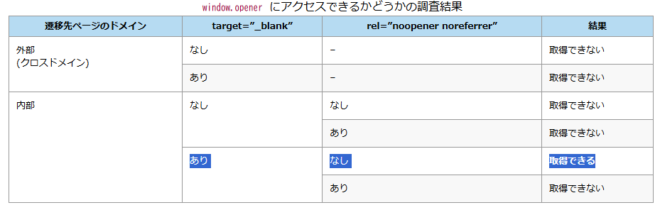
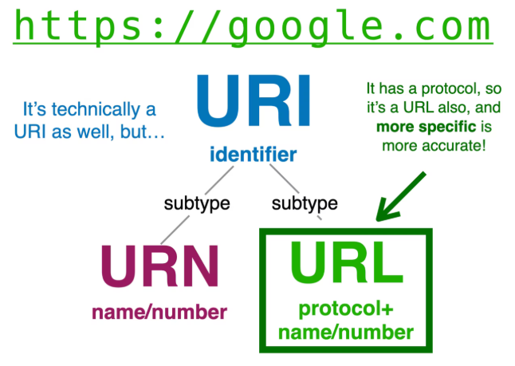
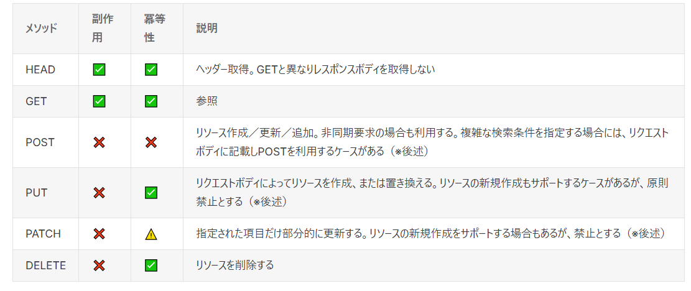

# 45 よく使うHTTPヘッダを理解する

>HTTPは様々な情報をやりとりします。その挙動の多くは「ヘッダー」で決まり、ヘッダーは無数にあるため、その設定次第では意図しない挙動が発生します。

>例えばヘッダーの一つ「referer」を理解していない人がやりがちなミスとして、秘匿性の高い情報を流出させることが挙げられます。

>クエリパラメータに誤って重要な情報（例えばトークンなど）を入れてしまった場合、refererの設定次第では外部サービスにクエリパラメータごと、トークン情報が送られてしまうことがあります

>ヘッダーはWEBサービスを扱う上では避けて通れない概念ですが、誤って使ってしまうと、予想外の挙動に繋がる可能性があります。http の基礎的な要素「ヘッダー」をきちんと理解しておきましょう！

## 1-1 ヘッダーの意味と役割

| ヘッダー | 利用例 | 意味 | 役割  |
| :--- | :--- | :--- | :--- |
| Host | `Host: www.example.com` | 送信先サーバーのホスト名とポート番号 | どのサーバーのどのポートにリクエストが送信されるか  |
| Content-Type | `Content-Type: application/json` |  送信するリソースの種別（MIMEタイプ） | 送受信されるデータの種類を伝える |
| User-Agent | `User-Agent: Mozilla/5.0 (Windows NT 10.0; Win64; x64) ...` | クライアントのソフトウェア情報 | サーバーがクライアントのブラウザやOSを識別し、コンテンツを最適化するために利用される  |
| Accept | `Accept: text/html, application/json` | クライアントが処理できるコンテンツタイプ | クライアントが受け入れ可能なレスポンスを受け取るため  |
| Referer | `Referer: https://www.google.com/` | 遷移元のページのURL | サーバーがユーザーの遷移元を分析したり、ログに記録したりするために使用する  |
| Accept-Encoding | `Accept-Encoding: gzip, deflate, br` | クライアントが理解できる圧縮方式 | サーバーが通信データを圧縮して転送速度を向上させるため  |
| Authorization | `Authorization: Bearer <token>` | クライアントの認証情報 | 保護されたリソースへのアクセスを許可するために、サーバーに認証情報（トークンなど）を送信する  |
| Location | `Location: /new-page.html` | リダイレクト先のURL | サーバーがクライアントに対して、別のURLにアクセスするように指示する（リダイレクト）  |

### レスポンス、リクエストヘッダー（chatgpt,notion）

ChatGPTとNotionについて、GETとPOST時のレスポンス、リクエストヘッダーにどのような値が含まれるかを調査した。

たくさんHTTPヘッダーがあるんだなあ、となった。

**ChatGPT レスポンスヘッダ GET**

```json
{
    "content-encoding": "br",
    "content-security-policy": "default-src 'self'; script-src 'nonce-6db5e8d0-971a-4230-8f20-23475e3a9d3b' 'self' 'wasm-unsafe-eval' chatgpt.com/ces https://*.chatgpt.com https://*.chatgpt.com/ ...",
    "content-type": "text/html; charset=utf-8",
    "cross-origin-opener-policy": "same-origin-allow-popups",
    "date": "Thu, 21 Aug 2025 06:24:13 GMT",
    "link": "<https://cdn.oaistatic.com/assets/root-m4lmbj1s.css>; rel=preload; as=style, <https://cdn.oaistatic.com/assets/conversation-small-mhem1ma1.css>; rel=preload; as=style",
    "referrer-policy": "strict-origin-when-cross-origin",
    "server": "cloudflare",
    "set-cookie": "__Secure-next-auth.session-token=eyJhbGciOiJkaXIiLCJlbmMiOiJBMjU2R0NNIn0...",
    "strict-transport-security": "max-age=31536000; includeSubDomains; preload",
    "x-content-type-options": "nosniff",
    "x-envoy-upstream-service-time": "72"
}
```

**ChatGPT リクエストヘッダ GET**

```json
{
  "accept": "*/*",
    "accept-encoding": "gzip, deflate, br, zstd",
    "accept-language": "ja,en-US;q=0.9,en;q=0.8",
    "authorization": "Bearer eyJhbGciO...",
    "content-length": "276",
    "content-type": "application/json",
    "cookie": "_Host-next-auth.csrf-token=3d3...",
    "oai-client-version": "prod-fefe8136fdc1ea602bde26bed3bb19135d164cbc",
    "oai-device-id": "0b157ccd-d2b8-4448-acfe-b4a32e1d98c0",
    "oai-language": "ja-JP",
    "origin": "https://chatgpt.com",
    "priority": "u=0,i",
    "referer": "https://chatgpt.com/",
    "sec-ch-ua": "\"Not;A=Brand\";v=\"99\", \"Google Chrome\";v=\"139\", \"Chromium\";v=\"139\"",
    "sec-ch-ua-mobile": "?0",
    "sec-ch-ua-platform": "\"Windows\"",
    "sec-fetch-dest": "empty",
    "sec-fetch-mode": "cors",
    "sec-fetch-site": "same-origin",
    "user-agent": "Mozilla/5.0 (Windows NT 10.0; Win64; x64) AppleWebKit/537.36 (KHTML, like Gecko) Chrome/139.0.0.0 Safari/537.36"
}
```

**ChatGPT レスポンスヘッダ POST**

```json
{
    "access-control-allow-credentials": "true",
    "access-control-allow-origin": "https://chatgpt.com",
    "cf-cache-status": "DYNAMIC",
    "cf-ray": "972839c0dfd119...",
    "content-encoding": "br",
    "content-type": "application/json",
    "cross-origin-opener-policy": "same-origin-allow-popups",
    "date": "Thu, 21 Aug 2025 06:24:13 GMT",
    "nel": "{\"success_fraction\":0.01,\"report_to\":\"cf-nel\",\"max_age\":604800}",
    "referrer-policy": "strict-origin-when-cross-origin",
    "report-to": "{\"endpoints\":[{\"url\":\"https://a.nel.cloudflare.com/report/v4?s=mSVRr0rXQrUHOP%2BJi%2F948ddoW...\"}],\"group\":\"cf-nel\",\"max_age\":604800}",
    "server": "cloudflare",
    "set-cookie": "__cf_bm=8Bah.fdmYo9s2...path=/; expires=Thu, 21-Aug-25 07:34:17 GMT; domain=.chatgpt.com; HttpOnly; Secure; SameSite=None",
    "strict-transport-security": "max-age=31536000; includeSubDomains; preload",
    "vary": "Origin",
    "x-build": "d38227785ef4-convo" 
}
```


**ChatGPT リクエストヘッダ GET**

```json
{
   "accept": "text/html,application/xhtml+xml,application/xml;q=0.9,image/avif,image/webp,image/apng,*/*;q=0.8,application/signed-exchange;v=b3;q=0.7",
    "accept-encoding": "gzip, deflate, br, zstd",
    "accept-language": "ja,en-US;q=0.9,en;q=0.8",
    "cache-control": "max-age=0",
    "cookie": "_Host-next-auth.csrf-token=3d3...",
    "priority": "u=0,i",
    "referer": "https://chatgpt.com/",
    "sec-ch-ua": "\"Not;A=Brand\";v=\"99\", \"Google Chrome\";v=\"139\", \"Chromium\";v=\"139\"",
    "sec-ch-ua-mobile": "?0",
    "sec-ch-ua-platform": "\"Windows\"",
    "sec-fetch-dest": "empty",
    "sec-fetch-mode": "cors",
    "sec-fetch-site": "same-origin",
    "upgrade-insecure-requests": "1",
    "user-agent": "Mozilla/5.0 (Windows NT 10.0; Win64; x64) AppleWebKit/537.36 (KHTML, like Gecko) Chrome/139.0.0.0 Safari/537.36"
}
```

**notion レスポンスヘッダ GET**

```json
{
   "accept-ranges": "bytes",
    "alt-svc": "h3=\":443\"; ma=86400",
    "cache-control": "no-cache",
    "cf-cache-status": "DYNAMIC",
    "cf-ray": "972839c0dfd119...",
    "content-encoding": "gzip",
    "content-security-policy": "script-src 'self' 'unsafe-inline' 'unsafe-eval' https://gist.github.com https://apis.google.com https://cdn.amplitude.com https://api.am ...",
    "content-type": "text/html; charset=utf-8",
    "date": "Thu, 21 Aug 2025 06:55:34 GMT",
    "document-policy": "include-js-call-stacks-in-crash-report",
    "etag": "\"833d723e0fca292879423beedc6a89\"",
    "expires": "0",
    "last-modified": "Thu, 21 Aug 2025 06:05:06 GMT",
    "pragma": "no-cache",
    "referrer-policy": "strict-origin-when-cross-origin",
    "server": "cloudflare",
    "server-timing": "r;dur=899",
    "strict-transport-security": "max-age=31536000; includeSubDomains; preload"
}
```

**notion リクエストヘッダ GET**

```json
{
    "accept": "text/html,application/xhtml+xml,application/xml;q=0.9,image/avif,image/webp,image/apng,*/*;q=0.8,application/signed-exchange;v=b3;q=0.7",
    "accept-encoding": "gzip, deflate, br, zstd",
    "accept-language": "ja,en-US;q=0.9,en;q=0.8",
    "cache-control": "max-age=0",
    "cookie": "notion_browser_id=dd...",
    "priority": "u=0,i",
    "referer": "https://www.notion.com/",
    "sec-ch-ua": "\"Not;A=Brand\";v=\"8\", \"Google Chrome\";v=\"139\", \"Chromium\";v=\"138\"",
    "sec-ch-ua-mobile": "?0",
    "sec-ch-ua-platform": "\"Windows\"",
    "sec-fetch-dest": "document",
    "sec-fetch-mode": "navigate",
    "sec-fetch-site": "same-origin",
    "upgrade-insecure-requests": "1",
    "user-agent": "Mozilla/5.0 (Windows NT 10.0; Win64; x64) AppleWebKit/537.36 (KHTML, like Gecko) Chrome/138.0.0.0 Safari/537.36" 
}
```


## 1-2 aタグにrel=noreferrerを設定しなかった場合に起きうる問題

> aタグにtarget="_blank"を設定したところ、先輩エンジニアから「ちゃんとrel=noreferrerを設定した？」と聞かれました。なぜそのような設定が必要なのでしょうか？rel=noreferrerを設定しなかった場合に起きうる問題を調べて、説明して下さい。


### セキュリティリスク

aタグに`target="_blank"`を設定すると新しいタブでリンク先が開くことができるが、rel=noreferrerを使用しない場合はセキュリティリスクがある。

例えば外部リンクのページBは、遷移元のページAを`window.opener`オブジェクトとして参照することができる。ページBが悪意あるサイトだった場合、`window.opener.location = <危険なURL>`のようにページAのコンテンツの書き換えが可能になる。

この脆弱性は、Tabnabbing（タブナビング）攻撃と呼ばれているらしい。

### 対策方法

aタグのrel属性に`noreferrer`を指定すると、window.opener経由での参照ができなくなり、また参照元のリンク情報を渡さないようにできる。

```html
<a href="xxxx.com" target="_blank" rel="noopener noreferrer">リンク名</a>
```

ただし、最近はセキュリティ対策が進み、ブラウザはリンク先を自動でnoreferrerを付与して開くようになっているらしい。

[window.opener を使って元ウィンドウの情報が取得できるかどうかの実験 – ラボラジアン](https://laboradian.com/test-window-opener)

> 

[Tabnabbing](https://chikuwamarux.hatenablog.com/entry/20220827/1661560669 )

>また、最近のChrome, Edge, FireFoxなどでは、リンクを自動的にnoopenerとして開くようになっているようです。
>[Feature: Anchor target=_blank implies rel=noopener by default](https://chromestatus.com/feature/6140064063029248)


## 1-3 refererのヘッダ

> 先輩エンジニアに「同じオリジンの時はrefererの情報を全部送って、別オリジンの時は、オリジン情報だけをrefererとして送信するように、HTTPヘッダを追加しておいてもらえる？」と頼まれました。HTTPヘッダーには、どんな値を追加する必要があるでしょうか？

HTTPヘッダーのReferrer-Policyに`origin-when-cross-origin`または`strict-origin-when-cross-origin`を追加する。

### `Referrer-Policy`

Referrer-Policyは、ブラウザがリクエストを送る際に、どの程度のリファラ情報を送るかを制御するためのHTTPヘッダー

リファラポリシーに指定できる値：[MDN - Referrer-Policy](https://developer.mozilla.org/ja/docs/Web/HTTP/Reference/Headers/Referrer-Policy)

なお、Chromeはリファラポリシーが指定されていなければ、デフォルトで`strict-origin-when-cross-origin`になる。

※：[Chrome の新しいデフォルトのReferrer-Policy - strict-origin-when-cross-origin](https://developer.chrome.com/blog/referrer-policy-new-chrome-default?hl=ja)


### 動作挙動

`strict-origin-when-cross-origin`を設定すると、以下の挙動になる

- 同じオリジン（same-origin）へのリクエスト：
  - `https://example.com/page1` から `https://example.com/page2`
    - リファラ： `https://example.com/page1` 
- 異なるオリジン（cross-origin）へのリクエスト：
  - `https://example.com/page1` から `https://another-site.com/other-page` 
    - リファラ： `https://example.com`


## 2 クイズ

### Q1：冪等性と安全性

HTTPメソッドにおける「冪等性」と「安全性」について、最も適切なものは次のうちどれでしょう？

1. 安全性:リクエストを何回繰り返しても結果が変わらない、冪等性:サーバー上のリソース状態を変更しない
2. 安全性:サーバー上のリソース状態を変更しない、冪等性:リクエストを何回繰り返しても結果が変わらない。
3. どちらもサーバー上のリソース状態を変更せず、何回繰り返しても結果が変わらない

### Q2:RESTの原則

REST（REpresentational State Transfer）の４原則として、以下が挙げられています：
アドレス可能性、ステートレス性、接続性、統一したインターフェース

では、RESTful APIにおいて、REST原則の「統一したインターフェース」とはどんな意味を指すのでしょうか。適切ものを選んでください。

1. やり取りされる情報自体で処理が完結し、サーバがクライアントのセッションなどの状態を管理しない。
2. 情報の操作（取得、作成、更新、削除）に、HTTPメソッド（GET, POST, PUT, DELETEなど）を用いる。
3. 提供する情報がURIを通して表現でき、すべてのリソースが一意なアドレスを持つ。
4. 情報の内部に、関連する他の情報へのリンクを含めることができる。


### Q3:URLとURIの説明として正しいものはどれか。

1. URIはURLの1つの形式である
2. URLはインターネットに限らないより大きな概念でのリソースの位置を示す文字列である
3. URIとURLのURはUniversal Requestの略である
4. URLはURIの1つの形式である

### 回答

Q1:

2が正しいです。

Q2:

2が正しいです。

参考：

> 統一インターフェースとは、URIで指し示したリソースに対する操作を、統一した限定的なインターフェースで行うアーキテクチャスタイルのことです。
>- HTTP/1.1では、GETやPOSTなど、メソッドが8個（主に5～6個）に限定されており、通常これ以上メソッドが増えることはありません。
>- この制約は、インターフェースの柔軟性に制限を加えることで、全体のアーキテクチャをシンプルにし、クライアントとサーバの実装の独立性を向上させます。
>- Webが多様なクライアントやサーバの実装で構成されているのは、統一インターフェースが一役買っています。
>- また、システム全体が階層化しやすくなり、ロードバランサやプロキシなどのコンポーネントをクライアントに意識させることなく導入できるのは、各コンポーネント間のインターフェースをHTTPで統一しているためです

>『Webを支える技術』より

https://qiita.com/k-mashi/items/36b011ed98ec784518c0#rest%E3%82%92%E6%A7%8B%E6%88%90%E3%81%99%E3%82%8B6%E3%81%A4%E3%81%AE%E3%82%A2%E3%83%BC%E3%82%AD%E3%83%86%E3%82%AF%E3%83%81%E3%83%A3%E3%82%B9%E3%82%BF%E3%82%A4%E3%83%AB

Q3:

4が正しいです。

> 

ちなみにURはUniform Resourceの略です。

## 3 考えてみよう

>様々なHTTPメソッドがありますが（GET/POST/PUT/PATCH/FETCHなど）、実現したいユースケースに適したメソッドを選択するのは意外と（特に更新系）大変です。例えば以下のケースを考えてみてください
Xのフォロー関係の破棄はPUT?PATCH?DELETE?
取引の取り消しはPUT?PATCH?DELETE?
お気に入りリストからの削除はPUT?PATCH?DELETE?
どこまでHTTPメソッドを本来の定義に沿って使うべきか、チームで話し合ってみてください。参考としてSlackやXなど有名サービスのAPIのドキュメントを読んでみると良いかもしれません！

### POST,PUT,PATCHの違い

### POST

- リソースを作成する
- RESTful原則に従う場合、リソースが新規に作られるため冪等性はない

### PUT

- リクエストボディによって、特定のリソースが作成または置き換えられる。
- RESTful原則に従う場合、リソースの値を書き換えるため冪等性がある

### PATCH

- 既存リソースに新しいものを付け足す、書き換える





### 課題のユースケース

- Xのフォロー関係の破棄	DELETE
- お気に入りリストからの削除 DELETE
- 取引の取り消し POST/DELETE/PUT/PATCH（場合による）

DBのレコードを削除するような行為であればDELETEになるが、取引の取り消しのような処理はどのようにデータベース上でデータを保存・変更しているかでどのメソッドにするかも変わっていきそう。

また、APIサーバをREST指向にするか、RPC指向にするか、GraphQLにするかでHTTPメソッドの指針も変わるっぽい。PUT,PATCHを使うのはREST思考をガイドラインとしてAPIサーバを立てるときになる

### 余談：QUERYメソッドというHTTPメソッド追加が提案中

新しいHTTPメソッドとして、QUERYメソッドを導入しませんか、という提案が検討中らしい。

URLにクエリパラメータを付けて、フィルター条件を付与した形でデータを取得するGETリクエストを送る場合があるが、QUERYメソッドはこの時にURLではなくリクエストボディにフィルタ条件を付与する形でリクエストを送る。

```HTTP
GET /api/v1/products?category=game&price_min=10000&sort_by=price_desc HTTP/1.1
Host: example.com
```

```HTTP
QUERY /api/products HTTP/1.1
Host: example.com
Content-Type: application/json

{
  "filter": {
    "category": "game",
    "price": {
      "min": 10000
    }
  },
  "sort": {
    "by": "price",
    "order": "desc"
  }
}
```

[新しいHTTPメソッド、QUERYメソッドの仕様 - ASnoKaze blog](https://asnokaze.hatenablog.com/entry/2021/11/09/231858)