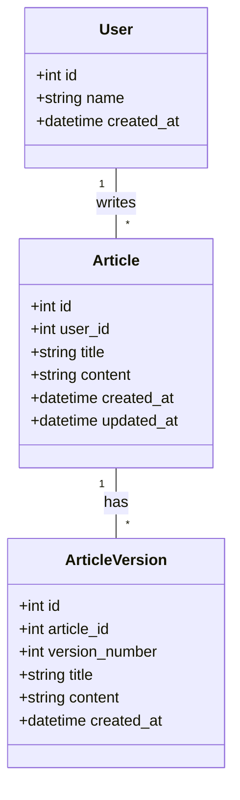

# 作成データベース

## ER 図

[https://dbdiagram.io/d/dbモデリング5-66ee9deca0828f8aa695d22b](https://dbdiagram.io/d/db%E3%83%A2%E3%83%87%E3%83%AA%E3%83%B3%E3%82%B05-66ee9deca0828f8aa695d22b)

### users テーブル

|カラム名|データ型|説明|
|---|---|---|
|id|int|主キー|
|name|varchar|ユーザー名|
|created_at|timestamp|作成日時|

### articles テーブル

|カラム名|データ型|説明|
|---|---|---|
|id|int|主キー|
|user_id|int|ユーザ id|
|history|int|更新を行う前の articles_id|
|subject|varchar(255)|記事タイトル|
|content|varchar(3000)|本文|
|created_at|timestamp|作成日時|
|updated_at|timestamp|更新日時|

## 記事履歴の保存方法について

記事履歴の保存方法について、以下の方針を採用しました：

1. 新規記事作成時：history カラムに 0 を設定し、初回の記事であることを示す。
2. 記事更新時：新しいレコードを作成し、history カラムに更新前の記事 ID を設定する。これにより、各更新が新しいレコードとして保存され、履歴が追跡可能になる。
3. 記事復元時：復元したい過去の記事 ID を基に新しいレコードを作成し、history カラムに現在の最新記事 ID を設定する。これにより、復元操作も履歴として記録される。

# データベースの DDL,DML,クエリ

## DDL

[https://github.com/kmishima16/praha/blob/main/db_modeling_5/subject1/docker-mysql/script/01_DDL.sql](https://github.com/kmishima16/praha/blob/main/db_modeling_5/subject1/docker-mysql/script/01_DDL.sql)

## DML

[https://github.com/kmishima16/praha/blob/main/db_modeling_5/subject1/docker-mysql/script/02_DML.sql](https://github.com/kmishima16/praha/blob/main/db_modeling_5/subject1/docker-mysql/script/02_DML.sql)

## 記事内容を更新するクエリ

- クエリ内の変数

|変数|内容|
|---|---|
|user_id|users テーブルの id|
|update_article_id|articles テーブルの id|
|now_subject|最新の記事タイトル|
|now_content|最新の記事内容|

[https://github.com/kmishima16/praha/blob/main/db_modeling_5/subject1/docker-mysql/script/03_update_article.sql](https://github.com/kmishima16/praha/blob/main/db_modeling_5/subject1/docker-mysql/script/03_update_article.sql)

## 記事データを復元するクエリ

- クエリ内の変数

|変数|内容|
|---|---|
|user_id|users テーブルの id|
|update_article_id|articles テーブルの id|
|now_subject|最新の記事タイトル|
|now_content|最新の記事内容|
|rebert_subject|復元対象の記事タイトル|
|rebert_content|復元対象の記事内容|

[https://github.com/kmishima16/praha/blob/main/db_modeling_5/subject1/docker-mysql/script/04_rebert_article.sql](https://github.com/kmishima16/praha/blob/main/db_modeling_5/subject1/docker-mysql/script/04_rebert_article.sql)

## 最新の記事一覧の取得

### SQL

[https://github.com/kmishima16/praha/blob/main/db_modeling_5/subject1/docker-mysql/script/05_select_latest_articles.sql](https://github.com/kmishima16/praha/blob/main/db_modeling_5/subject1/docker-mysql/script/05_select_latest_articles.sql)

### 実行結果

- 最新の記事データが取得できている。

- また、history = 0 を外すと、すべての記事が取得できる。

## ある記事のログを確認する

### SQL

[https://github.com/kmishima16/praha/blob/main/db_modeling_5/subject1/docker-mysql/script/06_select_article_log.sql](https://github.com/kmishima16/praha/blob/main/db_modeling_5/subject1/docker-mysql/script/06_select_article_log.sql)

### 実行結果

更新履歴が以下の並びで保存されていることを確認しました：

1. 最初の投稿
2. 第一回修正（記事更新）
3. 最初の投稿（記事の復元）

# 参考

[flint blog: 履歴を取ってみよう](http://www.flint.jp/blog/?entry=25)

## 課題 2

## ２－１

- 全ての更新データをデータベースとして保存する場合、レコードの UPDATE を行わず、すべての出来事を INSERT する必要がある。しかし、これにはテーブル数の増加、クエリの複雑化、レコード数の増大など、実装コストがかかるという懸念がある。
    
- 「履歴データの表示をアプリ上では実装せず、後から分析するためだけに必要」という場合、クラウドストレージやサーバ内のストレージにデータを蓄積することも一つの方法として考えられる。
    
- データの蓄積方法としては、以下が挙げられる：
    
    1. UPDATE クエリ発行時に更新前データを蓄積する
    2. タスクスケジューラでデータを定期的にエクスポートする
- 特定のクエリ操作を行った際に、自動的にユーザー定義関数を実行する機能を提供するフレームワークも存在します。例えば、
    
    - [https://www.prisma.io/docs/orm/prisma-client/client-extensions/query](https://www.prisma.io/docs/orm/prisma-client/client-extensions/query)
        - Prisma Query を使用することで、特定のクエリ発行時に指定した関数を実行できる
        - この機能を利用して、`logger` や `console.log()` などを関数に組み込み、ログを記録することが可能
            - コード：[https://www.prisma.io/docs/orm/prisma-client/client-extensions/query#modify-all-prisma-client-operations](https://www.prisma.io/docs/orm/prisma-client/client-extensions/query#modify-all-prisma-client-operations)

## 2-2

## 設計の説明

### 記事作成時の処理

- Article テーブルに insert

### 記事更新時の処理

- ArticleVersion テーブルに現在の Article テーブルの内容を insert
    - version_number は article_id ごとに auto increment させる
- Article テーブルを UPDATE

### 記事復元時の処理

- ArticleVersion テーブルに現在の Article テーブルの内容を insert
- 復元対象の version_number の acticleVersion を取得する
- 復元対象のレコードで Article テーブルを update

### 各記事の更新内容の取得

- ArticleVersion から、article_id を指定して表示する