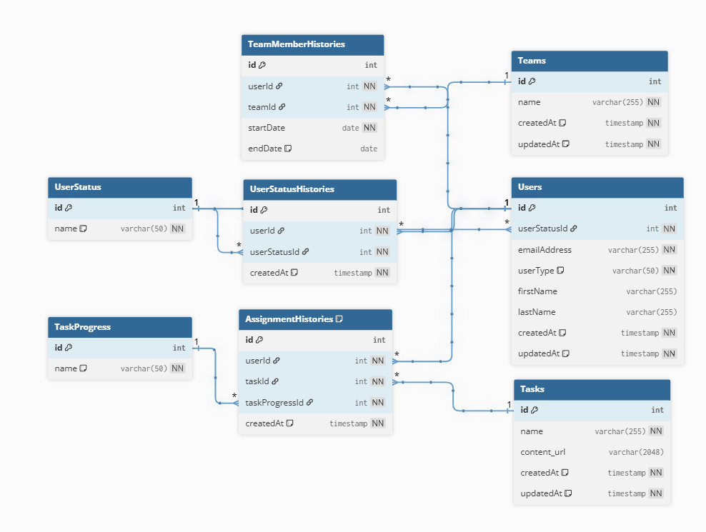

# 特大課題　DDD

仕様：https://separated-rover-67e.notion.site/DDD-03e9d01f643244f0ad9d80f148a46563

## ドメイン層


### ドメインモデル

task、student、team、assignmentの４つのエンティティで構成する。

**student,assignment**

- studentが生成されたとき、80個のassignmentも生成される。タスクの進捗ステータスは未着手
 - studentFactoryを介してstudentを生成する
   - studentEmailNotDuplicated　ドメインサービスを定義して、アプリケーション層でstudent生成時は重複チェック後にファクトリーを呼び出す
- studentはassignmentを所有している
- studentは自分が所有しているassignmentの進捗を確認できる
- studentはassignmentを更新でき、取り組み中、レビュー待ち、完了に変えることができる。
- studentに紐づくassignmentを追加、削除できる
- studentの在籍ステータスが休会または退会になった場合、teamManegementServiceを行いチーム人数の調整が行われる、という処理は、簡便的にアプリケーション層に書く。
  - 本格的にやるならユニットオブワークのようなパターンを導入して、トランザクション管理のような形で制約を表現する。またはドメインイベント

**team**

- teamはstudentIdを所有している
  - teamFactoryというドメインサービスに切り出す
    - team名の重複チェックして、チーム人数のバリデーションも行う
- teamManegementServiceで、複雑なチームメンバー操作のロジックを含んだadd,remove処理を行う
  - 参加者減少によってチーム人数が2名以下になった場合のメール通知（メール本文に必要情報を含めるなど）
  - 参加者が1名になる場合の自動合流処理（最も参加人数が少ないチーム選択やランダム選択）
  - 合流可能なチームがない場合の管理者メール通知
  - 参加者の復帰時に最適チームへの割当て
  - 参加が増えてチームが5名になる場合の自動分割処理
- メール送信用に、mailserviceinterfaceをドメイン層においておく。インフラ層のmail/mailserviceimplで実装する。

**task**

- taskを新しく作成できる
- taskのタイトルを変更できる
- 課題カテゴリは、めんどいからこのシステムだと扱わない

### 値オブジェクト

- メールアドレス（MailAddress）

- チーム名（TeamName）

## ユースケース

### アプリケーション層


task
- taskを作成する
- taskのタイトルを変更する

student,assignment
- student,assignmentを作成する
- studentを在籍、休会、退会にする　※
- 新しいassignmentをstudentに追加、削除する
- assignmentの進捗ステータスを着手、レビュー待ち、完了にする

team
- teamをつくる
- teamの人数を追加する、減らす　※

※の部分は、team人数の増減に関わる処理なので、`StudentAndTeamOrchestrationService`というクラスをアプリケーション層に置き、処理を共通化する。

## ER図



https://dbdiagram.io/d/6855053df039ec6d3619b8c0

```sql
//// ------------------------------------------------------
//// Users
//// ------------------------------------------------------

// ユーザー情報
Table Users {
  id int [pk, increment]
  userStatusId int [not null, ref: > UserStatus.id]
  emailAddress varchar(255) [unique, not null]
  userType varchar(50) [not null, note: '例: student, admin']
  firstName varchar(255)
  lastName varchar(255)
  createdAt timestamp [default: `now()`, not null]
  updatedAt timestamp [default: `now()`, not null]
}

// ユーザーの在籍ステータスのマスターデータ
Table UserStatus {
  id int [pk, increment]
  name varchar(50) [unique, not null, note: '例: 在籍, 休会, 退会']
}

// ユーザーの在籍ステータス変更履歴
Table UserStatusHistories {
  id int [pk, increment]
  userId int [not null, ref: > Users.id]
  userStatusId int [not null, ref: > UserStatus.id]
  createdAt timestamp [default: `now()`, not null]
}


//// ------------------------------------------------------
//// Teams
//// ------------------------------------------------------

// チーム情報
Table Teams {
  id int [pk, increment]
  name varchar(255) [unique, not null]
  createdAt timestamp [default: `now()`, not null]
  updatedAt timestamp [default: `now()`, not null]
}

// チームのメンバー履歴
// 誰が、いつからいつまで、どのチームに所属していたかを記録
Table TeamMemberHistories {
  id int [pk, increment]
  userId int [not null, ref: > Users.id]
  teamId int [not null, ref: > Teams.id]
  startDate date [not null]
  endDate date [null, note: 'NULLの場合は現在も所属中']
}


//// ------------------------------------------------------
//// Tasks & Progress
//// ------------------------------------------------------

// 課題のマスターデータ
Table Tasks {
  id int [pk, increment]
  name varchar(255) [not null]
  content_url varchar(2048)
  createdAt timestamp [default: `now()`, not null]
  updatedAt timestamp [default: `now()`, not null]
}

// 課題進捗ステータスのマスターデータ
Table TaskProgress {
  id int [pk, increment]
  name varchar(50) [unique, not null, note: '例: 未着手, 取組中, レビュー待ち, 完了']
}

// 生徒ごとの課題の進捗状況
// どの生徒が、どの課題を、どのステータスまで進めているかを記録
Table AssignmentHistories {
  id int [pk, increment]
  userId int [not null, ref: > Users.id]
  taskId int [not null, ref: > Tasks.id]
  taskProgressId int [not null, ref: > TaskProgress.id]
  createdAt timestamp [default: `now()`, not null]

  Indexes {
    (userId, taskId) [unique]
  }
}
```

### ディレクトリ構成

```bash
src
├── application
│   ├── query-service # 読み取り処理
│   │   ├── student-query-service.ts
│   │   └── team-query-service.ts
│   │   └── task-query-service.ts
│   │
│   └── use-case # 書き込み処理
│       ├── student
│       │   ├── create-student-use-case.ts
│       │   ├── add-assignment-to-student-use-case.ts
│       │   ├── remove-assignment-from-student-use-case.ts
│       │   └── update-assignment-progress-use-case.ts
│       │   └── change-student-status-use-case.ts
│       ├── team 
│       │   ├── create-team-use-case.ts
│       │   ├── add-member-to-team-use-case.ts
│       │   └── remove-member-from-team-use-case.ts
│       ├── task
│       │   ├── create-task-use-case.ts
│       │   └── edit-task-title-use-case.ts
│       └── orchestration # チーム人数増減に関する処理
│           └── StudentAndTeamOrchestrationService.ts 
├── domain
│   ├── student # Student集約
│   │   ├── student.ts
│   │   ├── assignment.ts
│   │   ├── value-object
│   │   │   └── mail-address.ts
│   │   ├── student-repository.ts 
│   │   ├── student-factory.ts # ドメインサービス（Factory）
│   │   └── student-email-not-duplicated.ts # ドメインサービス
│   ├── team # Teamエンティティ
│   │   ├── team.ts
│   │   ├── value-object
│   │   │   └── team-name.ts
│   │   ├── team-repository.ts
│   │   ├── team-factory.ts
│   │   └── team-management-service.ts
│   ├── task # Taskエンティティ
│   │   ├── task.ts
│   │   └── task-repository.ts
│   └── service # メール処理のインターフェース
│       └── mail-service.ts
│
├── infrastructure
│       ├── query-service
│       │   ├── postgresql-task-list-query-service.ts
│       │   ├── postgresql-task-query-service.ts
│       │   └── postgresql-todo-list-query-service.ts
│       ├── repository
│       │   └── postgresql-task-repository.ts
│       └── services # 外部サービス連携の実装
│           └── mail-service-impl.ts # MailServiceの実装
├── libs
│       ├── drizzle
│       │   ├── get-credentials.ts
│       │   ├── get-database.ts
│       │   └── schema.ts
│       └── ulid
│           └── index.ts
│
├── presentation
│       └── task
│           ├── create-task-controller.ts
│           ├── edit-task-title-controller.ts
│           ├── get-task-controller.ts
│           ├── get-task-list-controller.ts
│           └── set-task-done-controller.ts
│       └── student
│           ├── student登録、取得、在席ステータス変更
│           └── studentにassignment追加、削除
│           └── assignmentの進捗ステータス変更
│       └── team
│           ├── team作成、一覧取得、チーム情報取得
│           └── teamにメンバー追加、削除


```