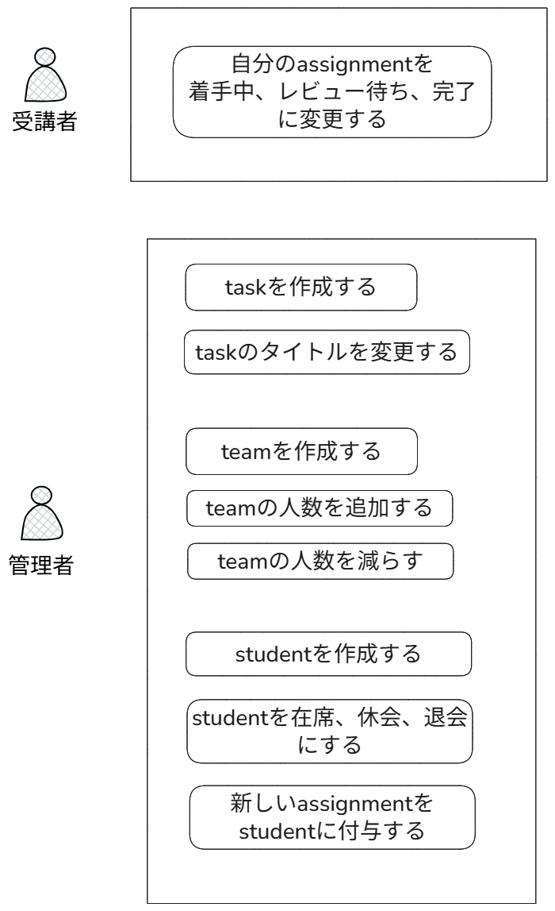
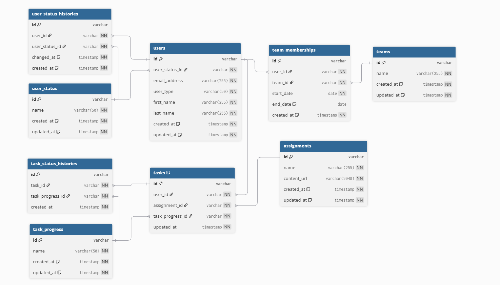

# 特大課題　DDD

仕様：https://separated-rover-67e.notion.site/DDD-03e9d01f643244f0ad9d80f148a46563

## ドメイン層


### ドメインモデル

task、student、team、assignmentの４つのエンティティで構成する。

**student,task**

 - studentFactoryを介してstudentを生成する
   - studentEmailNotDuplicated　ドメインサービスを定義して、アプリケーション層でstudent生成時は重複チェック後にファクトリーを呼び出す
- studentに紐づくtaskを追加、削除できる
- studentの在籍ステータスが休会または退会になった場合、teamManegementServiceを行いチーム人数の調整が行われる、という処理は、簡便的にアプリケーション層に書く。
  - 本格的にやるならユニットオブワークのようなパターンを導入して、トランザクション管理のような形で制約を表現する。またはドメインイベント

**task**

- ドメインサービスがこの処理を担当する
  - studentが生成されたとき、80個のtaskも生成される。タスクの進捗ステータスは未着手
  - studentはtaskを更新でき、取り組み中、レビュー待ち、完了に変えることができる。
- studentは自分が所有しているtaskの進捗を確認できる


**team**

- teamはstudentIdを所有している
  - teamFactoryというドメインサービスに切り出す
    - team名の重複チェックして、チーム人数のバリデーションも行う
- teamManegementServiceで、複雑なチームメンバー操作のロジックを含んだadd,remove処理を行う
  - 参加者減少によってチーム人数が2名以下になった場合のメール通知（メール本文に必要情報を含めるなど）
  - 参加者が1名になる場合の自動合流処理（最も参加人数が少ないチーム選択やランダム選択）
  - 合流可能なチームがない場合の管理者メール通知
  - 参加者の復帰時に最適チームへの割当て
  - 参加が増えてチームが5名になる場合の自動分割処理
- メール送信用に、mailserviceinterfaceをドメイン層においておく。インフラ層のmail/mailserviceimplで実装する。

**assignment**

- assignmentを新しく作成できる
- assignmentのタイトルを変更できる
- 課題カテゴリは、めんどいからこのシステムだと扱わない

### 値オブジェクト

- メールアドレス（MailAddress）

- チーム名（TeamName）

## ユースケース

### アプリケーション層



assignment
- assignmentを作成する
- assignmentのタイトルを変更する

task
- taskを作成する
- 新しいtaskをstudentに追加、削除する
- taskの進捗ステータスを着手、レビュー待ち、完了にする

student
- studentを作成する
- studentを在籍、休会、退会にする　※

team
- teamをつくる
- teamの人数を追加する、減らす　※

※の部分は、team人数の増減に関わる処理なので、`StudentAndTeamOrchestrationService`というクラスをアプリケーション層に置き、処理を共通化する。

## ER図

**初期案。実装が進むごとに変更されるので、イメージとして扱うこと。**



https://dbdiagram.io/d/Copy-of-Untitled-Diagram-68bb065161a46d388eaaaca3

```sql
//// ------------------------------------------------------
//// Users
//// ------------------------------------------------------

Table users {
  id varchar [pk]
  user_status_id varchar [not null]
  email_address varchar(255) [not null, unique]
  user_type varchar(50) [not null]
  first_name varchar(255) [not null]
  last_name varchar(255) [not null]
  created_at timestamp [not null, default: `now()`]
  updated_at timestamp [not null, default: `now()`]
}

Table user_status {
  id varchar [pk]
  name varchar(50) [not null, unique]
  created_at timestamp [not null, default: `now()`]
  updated_at timestamp [not null, default: `now()`]
}

Table user_status_histories {
  id varchar [pk]
  user_id varchar [not null]
  user_status_id varchar [not null]
  changed_at timestamp [not null, default: `now()`]
  created_at timestamp [not null, default: `now()`]
}

//// ------------------------------------------------------
//// Teams
//// ------------------------------------------------------

Table teams {
  id varchar [pk]
  name varchar(255) [not null, unique]
  created_at timestamp [not null, default: `now()`]
  updated_at timestamp [not null, default: `now()`]
}

Table team_memberships {
  id varchar [pk]
  user_id varchar [not null]
  team_id varchar [not null]
  start_date date [not null]
  end_date date [note: 'NULLの場合、現在も所属中']
  created_at timestamp [not null, default: `now()`]
}

//// ------------------------------------------------------
//// Tasks & Progress
//// ------------------------------------------------------

Table assignments {
  id varchar [pk]
  name varchar(255) [not null]
  content_url varchar(2048) [not null]
  created_at timestamp [not null, default: `now()`]
  updated_at timestamp [not null, default: `now()`]
}

Table task_progress {
  id varchar [pk]
  name varchar(50) [not null, unique]
  created_at timestamp [not null, default: `now()`]
  updated_at timestamp [not null, default: `now()`]
}

Table tasks {
  id varchar [pk]
  user_id varchar [not null]
  assignment_id varchar [not null]
  task_progress_id varchar [not null]
  updated_at timestamp [not null]
  
  Indexes {
    (user_id, assignment_id) [unique]
  }
}

Table task_status_histories {
  id varchar [pk]
  task_id varchar [not null]
  task_progress_id varchar [not null]
  created_at timestamp [not null]
}

//// ------------------------------------------------------
//// Relations
//// ------------------------------------------------------

Ref: users.user_status_id > user_status.id
Ref: user_status_histories.user_id > users.id
Ref: user_status_histories.user_status_id > user_status.id

Ref: team_memberships.user_id > users.id
Ref: team_memberships.team_id > teams.id

Ref: tasks.user_id > users.id
Ref: tasks.assignment_id > assignments.id
Ref: tasks.task_progress_id > task_progress.id

Ref: task_status_histories.task_id > tasks.id
Ref: task_status_histories.task_progress_id > task_progress.id
```

### ディレクトリ構成案

**初期案。実装が進むごとに変更されるので、イメージとして扱うこと。**

```bash
src
├── application
│   ├── query-service # 読み取り処理
│   │   ├── student-query-service.ts
│   │   └── team-query-service.ts
│   │   └── task-query-service.ts
│   │
│   └── use-case # 書き込み処理
│       ├── student
│       │   ├── create-student-use-case.ts
│       │   ├── add-assignment-to-student-use-case.ts
│       │   ├── remove-assignment-from-student-use-case.ts
│       │   └── update-assignment-progress-use-case.ts
│       │   └── change-student-status-use-case.ts
│       ├── team 
│       │   ├── create-team-use-case.ts
│       │   ├── add-member-to-team-use-case.ts
│       │   └── remove-member-from-team-use-case.ts
│       ├── task
│       │   ├── create-task-use-case.ts
│       │   └── edit-task-title-use-case.ts
│       └── orchestration # チーム人数増減に関する処理
│           └── StudentAndTeamOrchestrationService.ts 
├── domain
│   ├── student # Student集約
│   │   ├── student.ts
│   │   ├── assignment.ts
│   │   ├── value-object
│   │   │   └── mail-address.ts
│   │   ├── student-repository.ts 
│   │   ├── student-factory.ts # ドメインサービス（Factory）
│   │   └── student-email-not-duplicated.ts # ドメインサービス
│   ├── team # Teamエンティティ
│   │   ├── team.ts
│   │   ├── value-object
│   │   │   └── team-name.ts
│   │   ├── team-repository.ts
│   │   ├── team-factory.ts
│   │   └── team-management-service.ts
│   ├── task # Taskエンティティ
│   │   ├── task.ts
│   │   └── task-repository.ts
│   └── service # メール処理のインターフェース
│       └── mail-service.ts
│
├── infrastructure
│       ├── query-service
│       │   ├── postgresql-task-list-query-service.ts
│       │   ├── postgresql-task-query-service.ts
│       │   └── postgresql-todo-list-query-service.ts
│       ├── repository
│       │   └── postgresql-task-repository.ts
│       └── services # 外部サービス連携の実装
│           └── mail-service-impl.ts # MailServiceの実装
├── libs
│       ├── drizzle
│       │   ├── get-credentials.ts
│       │   ├── get-database.ts
│       │   └── schema.ts
│       └── ulid
│           └── index.ts
│
├── presentation
│       └── task
│           ├── create-assignment-controller.ts
│           ├── edit-assignment-title-controller.ts
│           ├── get-assignment-controller.ts
│           ├── get-assignment-list-controller.ts
│           └── set-assignment-done-controller.ts
│       └── student
│           ├── student登録、取得、在席ステータス変更
│           └── studentにtask追加、削除
│           └── taskの進捗ステータス変更
│       └── team
│           ├── team作成、一覧取得、チーム情報取得
│           └── teamにメンバー追加、削除


```