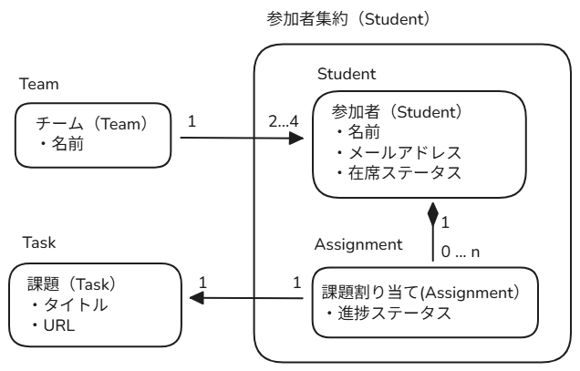
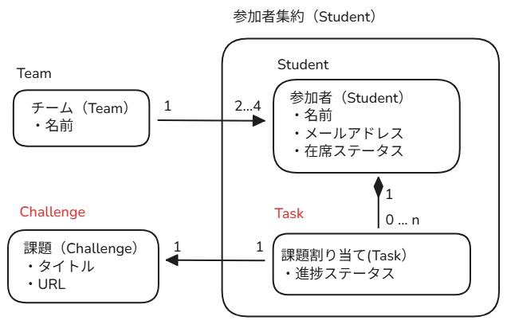

## TODO

- [x] studentが新規作成された時、各課題のtaskも生成する。初期ステータスは「着手中」
- [ ] studentは、自分の課題の進捗ステータスを変更できる。
- [ ] studentのメールアドレスは重複不可
- [ ] studentの在席ステータスは「在席中」、「休会中」、「退会済み」、「卒業」
- [ ] teamを作成できる（チーム名は英文字、重複不可）
- [ ] studentをteamに所属または脱退できる
- [ ] studentが休会中または退会済みになった場合、teamの所属対象から外す
- [ ] teamの人数が1名以下または5名以上になった場合、notionの仕様に従い再編処理を行う

## 動作確認

### studentの生成

- curlで事前にいくつか課題を登録しておく。
- studentを作成するcurlを発行
- 各テーブルに値が書き込まれている。


## きになったことのメモ 09/10

## enum, union, as constの使い分け

[enum, union, as constって意思を持って使い分けてる？](https://zenn.dev/arfes/articles/e90c3b0bc30b08)

> `type StudentStatus = "在籍中" | "休会中" | "退会済" | "卒業済";`

こういう在席ステータスみたいな変数の表現は、

```ts
enum StudentStatus {
  ENROLL = '在籍中',
  WITHDRAW = '休会中',
  GRADUATE = '卒業済',
  LEAVE = '退会済',
}
```

```ts
type StudentStatus = "在籍中" | "休会中" | "退会済" | "卒業済";
```

```ts
const STUDENT_STATUS = {
  ENROLL: '在籍中',
  WITHDRAW: '休会中',
  LEAVE: '退会済',
  GRADUATE: '卒業済',
} as const;

type StudentStatus = typeof STUDENT_STATUS[keyof typeof STUDENT_STATUS];
```

みたいに３パターンの書き方があるが、この書き方に使い分けはあるか？

影響範囲が大きくないの型であれば、UNION型で定義してしまえばよい？

→　基本UNIONで困ることはないらしい・・・（実際に実装してみた感じ、そうだと思った）

→　以下UNIONとENUMの書き方、どっちがわかりやすい？という議論かも？

```ts
  public static create(
    firstName: string,
    lastName: string,
    email: MailAddress,
  ): Student {
    const id = ulid();
    const status = StudentStatus.ENROLL; // enum
    return new Student(id, firstName, lastName, email, status);
  }

  public static create(
    firstName: string,
    lastName: string,
    email: MailAddress,
  ): Student {
    const id = ulid();
    const status: StudentStatus = "在籍中"; // union
    return new Student(id, firstName, lastName, email, status);
  }

```

## `readonly id`と `private id` と `#id`の違いは？

`private id` と `#id`の使い分けは、基本`#`で良いらしい。
- readonly: 外部クラスから読み取り可能
- private: アクセス修飾子 クラス内部からのみアクセス可能
- `#id`: ECMAScriptのプライベートフィールド JSの言語レベルで強制されるプライベート コンパイル後のJSでもアクセスが出来ない

## ユビキタス言語の命名センス

「課題マスタ：Task」、「各生徒の課題の取り組み状況:Assignment」と定義していたのだが、

意味合い的には、「課題マスタ：Assignment」、「各生徒の課題の取り組み状況:Task」と定義した方がすっきりするな、と思ったので、drizzleのマイグレーションが終わって、ドメイン層のコードを書いている途中で[rename作業を行った。](https://github.com/kmishima16/praha-challenge-ddd/pull/1)

その後実装をさらに進めていくと、「課題マスタはAssignmentじゃなくてChallenge」にしたほうがしっくりくるな・・・と思い始めた。

→最初にしっくりくる命名をいかに詰められるかがセンスだなと感じた。後でDBの構造変えるのとても大変

before 

> 

after

> 

## ドメイン層のディレクトリ構造

ドメイン層のディレクトリ構造は、現在以下のような形にしている

```bash
├── domain
│   ├── student # Student集約
│   │   ├── student.ts # studentエンティティ
│   │   ├── task.ts # taskエンティティ
│   │   ├── value-object
│   │   │   └── mail-address.ts # メールアドレス
│   │   └── student-repository.ts 
│   ├── team
│   │   ├── team.ts
│   │   └── team-repository.ts
│   ├── assignment
│   │   ├── assignment.ts
│   │   └── assignment-repository.ts
│   └── services # ドメインサービス
│       └── create-new-student-with-initial-tasks.ts
```

以下の点を気にしている：
- ドメインサービスの置き場所は`domain/services`でよい？
- 「studentのメールアドレスは重複してはいけない」という実装も、`domain/services`においてよい？

`create-new-student-with-initial-tasks.ts`は、「studentは新規作成時に未着手状態の各課題のtaskが付与される」という仕様のもと、assignment-repository経由でassignmentを`findAll()`して、studentのインスタンスを作成する。

このような、複数エンティティをまたぐ、リポジトリが必要な仕様をドメイン層で実装するためには、ドメインサービスが必要、という認識。

→　この認識であってますかね？

では、「studentはメールアドレスが重複してはならない」というドメインルールはどのように実装して、どこに配置しておくのが分かりやすいのだろうか・・・？となっている

- student-repositoryに`findByMailAddress()`などのメソッドを用意して、永続化層からメールアドレスが重複するレコードがあるかをチェックする実装になりそう
- 先ほどの複数集約にまたがる話とちがって、メールアドレス重複チェックは`student`の集約にしか影響がない
  - であれば、`domain/student/mail-address-not-duplicated.ts`のようなファイル配置でもよいのでは？ 

→　分かりやすさ的な観点で言うと、どうするのが良いのでしょうか？

## DDDのトリレンマ

先週の議論で、「student集約にtaskを含めたら、studentで何か1つ更新するだけでも、全てのtaskも上書き保存しないといけないの、パフォーマンス的には必要のない処理では？」みたいな話があったと思いますが、これと関連したことに触れている記事でした。

「すべての実装仕様をコントローラ層に漏らさず、ドメイン層にすべて記述する」、「ドメインモデルはリポジトリに依存してはいけない」、「集約内でパフォーマンスを落とさずに実装仕様を実現する」の **３つの要求について、全て同時に実装することは無理で、２つまでしか選べませんよ！！** という話らしい。

> [DDDになぜ失敗するのか DDDのトリレンマ](https://zenn.dev/dorarep/articles/6e8dbdd517487c)
- このように以下の３つの要素のうち２つしか選ぶことができないというのが、DDDのトリレンマです。
    - 完全性：ドメインモデル内でドメインロジックが完結している
    - 純粋性：ドメインモデルはドメインモデルかプリミティブ型にしか依存しない
    - 性能：リソース使用量が大きすぎない
- **３つの要素のうち２つしか選ぶことができない、つまりDDDで開発する上でこのトリレンマから何を選び何を捨てるのか常に判断を迫られることになります。**
- これに対し元記事では、性能を捨てるのは現実的でなく、完全性より純粋性を優先させる方が良いと結論づけられています。
- そこで[Domain model purity and lazy loading](https://enterprisecraftsmanship.com/posts/domain-model-purity-lazy-loading)では、遅延読み込みを用いることでAggregateのパフォーマンスを損なうことなくより大きな集約を操作できるとしています。要するにデータが必要になったタイミングでDBリクエストを実行することで、性能を保ちつつ集約を大きくすることができます

>ChangeEmailは全てのドメインロジックを内包した『完全性』のあるものであると言えます。
ではここに同じメールアドレスが複数登録できないルールが追加されたらどうでしょうか？
素直な実装は、以下のようにコントローラーに記載する方法です。

→メールアドレス重複処理の話にも触れられてました。コントローラ層に重複チェックを書くか（純粋性）、ドメインサービスで書くようにするか（完全性）、全てのstudentのオブジェクトを引数にして重複チェックするか（性能）はトレードオフだそうです。

## application, infrastructureの`query-service`ディレクトリについて

サンプルリポジトリだと、以下のように`query-service`, `use-case`のようなフォルダがあり、どのような使い分けでディレクトリを切っているのかあまり理解できていなかったが、調べてみたところ、CQRSに則った実装で、`query-service`は読み取りだけ行うためのサービスらしい。

→ DDD課題で実装する処理は、ほとんどがPOST,PATCH処理になるので、`query-service`側で何か実装するようなものは無い？

```txt
src
├── application
│   ├── query-service 
│   │   ├── student-query-service.ts
│   │   └── team-query-service.ts
│   │   └── task-query-service.ts
│   └── use-case
│
├── infrastructure
│       ├── query-service
│       │   ├── postgresql-task-list-query-service.ts
│       │   ├── postgresql-task-query-service.ts
│       │   └── postgresql-todo-list-query-service.ts
│       ├── repository
│       │   └── postgresql-task-repository.ts

```