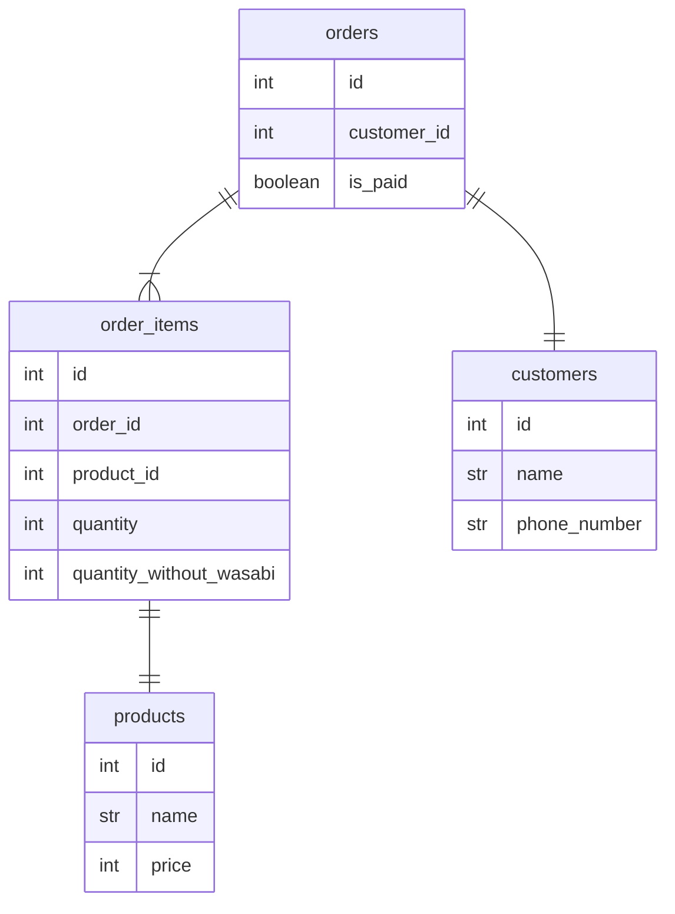

https://mermaid-js.github.io/mermaid-live-editor/edit#pako:eNqFUsFugzAM_ZXIZ1qFQqDjvOtOu01IKCXpGqlJWHDUdcC_L1Cg6zRpycXv5eXZcdxBbYWEAqR7VvzdcV2a0lgnpGtJ3282fUcmVCmUui1ICWE_CHpS-xatDsTD8e3GommcFb7GVbJ6dKUhYSmDRIl7vHhWC3mw9iy5IaqtGj6Sw2oyZ5qc7j5jNB-veK7iB_PhuUGF19-4uig8WY_Vhbf8oOZ060v_KrtFRwzX8o6akzWyMl4fpJsdlj78b3CrV9UBDhBByKrDu8NXTTdLwJMMUhgbKuSR-zOOfR2l3KN9vZoaCnReRuAbwVHO_wvFkZ_bwDbcvFmrF1GAUHTwCUUSZ9s82aU5y_NdFjOWRnANNNvSNMtzSpM4zVicpkMEX5MD3e4ZY5Tu8-yJJixJniKQQqF1L7fpmoZs-AawgtGj

