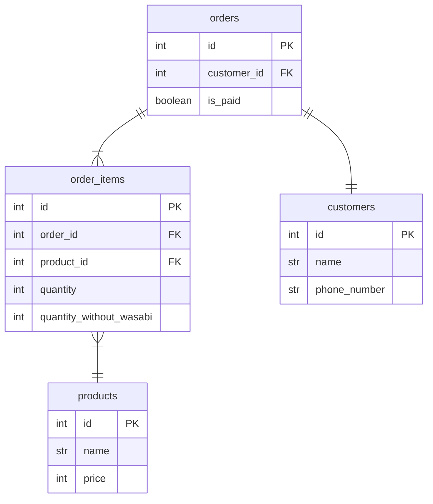
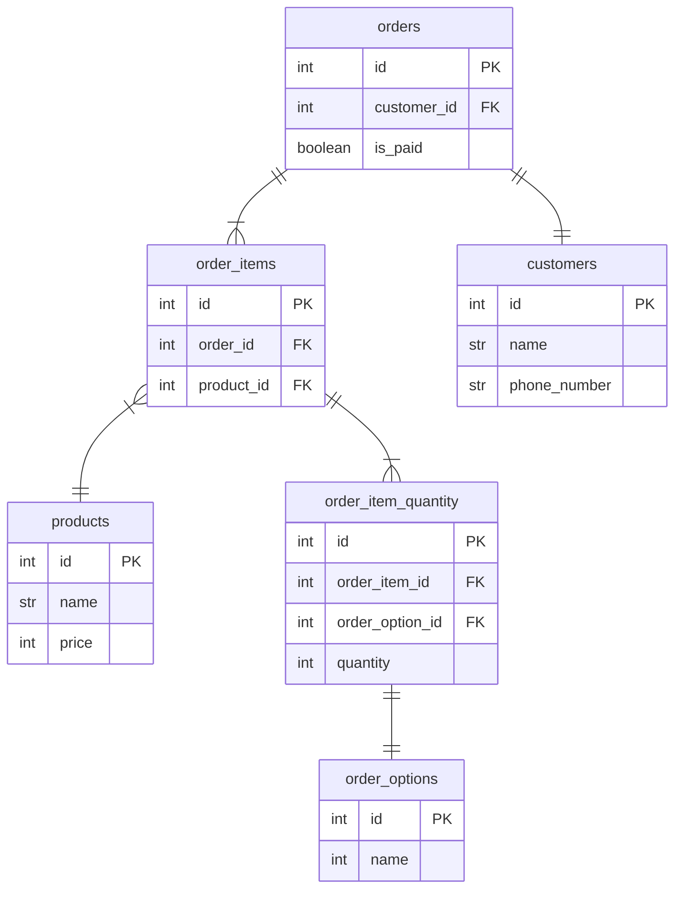
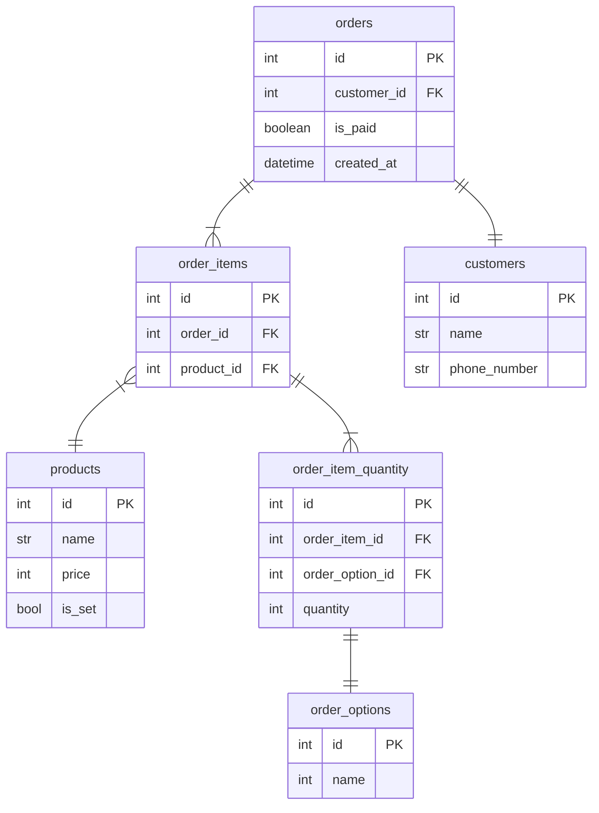

# 課題2-1

わさび有り無しに加えて、シャリの大小も管理できるようなシステムにする。  
どのような変更を加えれば良いか？

## 課題1時点のテーブル



## テーブル更新

### 方針

- 注文オプションのマスタを作る
- 注文商品について、どのオプションが何皿必要か分かるテーブルを作る

### ER図

- order_item_detailsテーブルを追加
  - order_itemsの数量、オプションを管理するテーブル
- order_optionsテーブルを追加
  - オプションの内容を記載するテーブル
  - ワサビ抜き かつ シャリ大 や、ワサビあり かつ シャリ小など、オプションの組み合わせを登録してもよい
- 各ネタの皿数とオプションの管理を別テーブルに移したので、order_itemsからquantity, quantity_without_wasabiを削除



# 課題2-2

セット商品とは別に、単品商品が毎月何個売上できているか集計したい  
SQLで集計する場合はどのようなコードを書くか  
また、テーブル構成に変更の必要がある場合は変更する

## テーブル変更

- 商品にセットor単品のフラグを付けるため、productsにis_setを追加  
- 注文日でフィルタするため、ordersにcreated_atを追加

### ER図



## 集計SQL

```SQL
SELECT
  products.name AS product_name
  products.price AS price
  DATE_FORMAT(orders.created_at, '%Y-%m') AS order_month
FROM
  order_items
JOIN
  orders ON order_items.order_id = orders.id
JOIN 
  products ON order_items.products_id = products.id
LEFT JOIN
  order_item_quantity 
ON 
  order_items.id = order_item_quanty.order_item_id
WHERE
  products.is_set = false
GROUP BY
  order_month, products.id

```

# 課題2-3

トリオと課題を交換し、その課題を満たすような仕様でテーブルを設計し直してみてください

## 課題案

### クーポンの導入

- クーポンには対象商品、期限、割引額がある

### 会員ランクの導入

#### 会員の種類

ブロンズ、シルバー、ゴールド会員がある

#### 会員ポイント

- 注文１回につき1ポイント
- 購入金額1000円につき1ポイント

#### ランク昇格条件

- ブロンズ：1ポイント～
- シルバー：10ポイント～
- ゴールド：50ポイント～

#### 会員特典

- ブロンズ：会計5%オフ
- シルバー：会計10%オフ
- ゴールド：会計10%オフ、配送料無料（ただし10貫以上の注文に限り）

## テーブル設計
